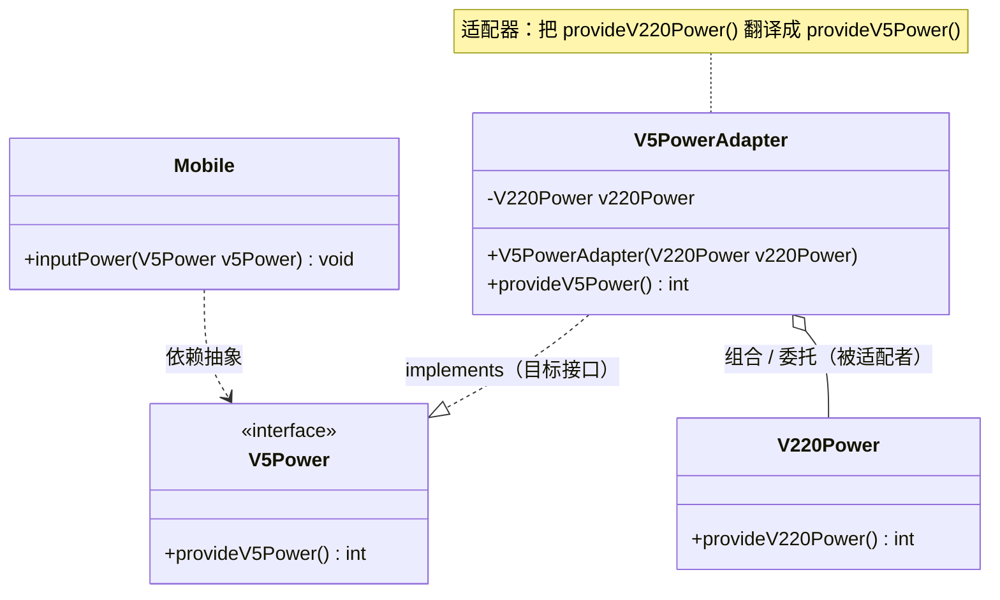

# 适配器模式 (Adapter Pattern)

---

## 目录

- [一、模式概述](#一模式概述)
- [二、通俗易懂的例子：先懂概念再看代码](#二通俗易懂的例子先懂概念再看代码)
- [三、模式结构](#三模式结构)
- [四、代码详解](#四代码详解)
- [五、设计推导：从坏设计到适配器模式](#五设计推导从坏设计到适配器模式)
- [六、适配器家族：四种实现方式](#六适配器家族四种实现方式)
- [七、JDK / Spring / 框架中的适配器模式](#七jdk--spring--框架中的适配器模式)
- [八、业务场景深度解析](#八业务场景深度解析)
- [九、优缺点分析与改进建议](#九优缺点分析与改进建议)
- [十、与其他模式对比](#十与其他模式对比)
- [十一、设计原则体现](#十一设计原则体现)
- [十二、面向对象视角解析](#十二面向对象视角解析)
- [十三、面试高频问答](#十三面试高频问答)
- [十四、复习要点](#十四复习要点)
- [十五、项目文件索引](#十五项目文件索引)

---

## 一、模式概述

### 1.1 定义

适配器模式（Adapter Pattern）是一种**结构型设计模式**。它把一个类的接口，转换成客户端所期望的另一个接口，从而使原本因为**接口不兼容**而无法一起工作的类，可以协同工作。

关键词有三个：

| 关键词 | 含义 | 本项目对应 |
|--------|------|-----------|
| **接口不兼容** | 两个类都有能力，但方法名 / 参数 / 返回值对不上 | `V220Power.provideV220Power()` 与 `V5Power.provideV5Power()` 签名不同 |
| **转换** | 不改任何一方的源码，只在中间加一层"翻译" | `V5PowerAdapter` |
| **客户端期望** | 以客户端需要的接口为目标来重塑 | `Mobile.inputPower(V5Power)` |

### 1.2 别名

- 转换器模式（Transformer Pattern）
- 包装器模式（Wrapper，GoF 书中明确提到这个别名）
- 适配模式 / 转接器模式

### 1.3 核心思想

**不修改现有代码，而是新增一个中间层来"翻译"接口。**

面对一个"接口不匹配"的问题，直觉反应往往是去改代码——改调用方，或者改被调用方。但真实工程里，往往有一方是**不能改、不该改、改不动**的：

- 不能改：第三方 SDK、jar 包、没有源码的老系统；
- 不该改：被 100 处调用的稳定核心类，动它风险极高；
- 改不动：接口由外部规范决定（如国标插头、银行报文格式）。

适配器模式的答案是：**新增一个类，把"已有能力"包装成"期望接口"**。原有双方都不动，兼容成本全部由这个新增的适配器承担。

### 1.4 类图定位

GoF 23 种设计模式中的**结构型模式**（Structural Pattern）。

结构型模式家族一览，便于定位：

| 结构型模式 | 一句话职责 | 是否改变接口 |
|-----------|-----------|-------------|
| **适配器 Adapter** | 转换接口，让不兼容双方协作 | ✅ **改变**（把 A 接口转成 B 接口） |
| 桥接 Bridge | 抽象与实现分离，让两侧独立变化 | ❌ 不改变，提前解耦 |
| 组合 Composite | 树形结构，统一处理单个对象与对象集合 | ❌ 不改变 |
| 装饰 Decorator | 动态加功能，保持接口不变 | ❌ **明确不改变** |
| 外观 Facade | 为子系统提供统一的高层入口 | ⚠️ 新建简化接口，但不是"转换已有接口" |
| 享元 Flyweight | 共享细粒度对象以省内存 | ❌ 不改变 |
| 代理 Proxy | 控制访问，接口与被代理者完全一致 | ❌ **必须一致** |

> **记忆钩子**：结构型模式里，**只有适配器模式的初衷是"改变接口"**。装饰、代理都要求接口保持一致，适配器恰恰相反——它的存在就是为了"把不同变成相同"。这一句能秒杀一大半面试题。

### 1.5 一句话理解

**"两个接口对不上，中间加个翻译官"**——先把这句话记住，再往下看例子。本项目里，`V220Power`（220V 交流电）就是"只会说中文的人"，`Mobile`（手机，只吃 5V）就是"只会说英文的人"，`V5PowerAdapter`（充电头）就是站在中间那位翻译官。

### 1.6 它解决的问题类型

适配器模式处理的不是"算法不好"，也不是"耦合太紧"，而是一类非常具体的问题：**存量能力与新需求之间的接口错配**。典型触发场景：

1. **遗留系统兼容**：老系统的方法名和参数与新架构的接口定义不一致（最常见）。
2. **第三方库集成**：想用某个 SDK，但它的 API 形状不符合你的领域模型；更关键的是——**你不想让整个系统到处散落在第三方 SDK 的 API 上**，于是写一层适配器把它包住（这一层也常被叫作 Anti-Corruption Layer，防腐层）。
3. **多版本 / 多厂商接口归一**：同时接入微信、支付宝、银联三家支付，各家 API 各不相同，用适配器统一成自己的 `PaymentService`。
4. **接口职责过重的隔离**：一个接口有 10 个方法，实现类只想用其中 2 个——用**缺省适配器**（抽象类空实现）屏蔽无关方法（见 [6.3](#63-缺省适配器default-adapter)）。
5. **数据结构形状转换**：`List` → `Set`、`byte[]` → `char[]`、`Map` → POJO。

### 1.7 什么时候不该用

这一点比"什么时候用"更重要：

| 反模式 | 为什么糟糕 | 应该怎么做 |
|--------|-----------|-----------|
| **为了用模式而用模式** | 两个接口本来就能直接调用，硬塞一层适配器，凭空多一层间接 | 直接调用。适配器只在"不兼容"时才登场 |
| **在适配器里塞业务逻辑** | 适配器变成"上帝类"，职责混乱，无法复用也无法测试 | 适配器只做**接口翻译**；翻译过程中的业务转换下沉到 Service |
| **用适配器掩盖设计错误** | 明明应该修接口，却用一层层适配器绕过去，最后适配器比业务代码还多 | 允许重构的新项目，直接把接口设计对 |
| **适配器链过长** | A→B→C→D 层层转换，一次调用穿 4 层，性能与可读性双输 | 合并中间层，或统一到公共模型（Canonical Model） |

---

## 二、通俗易懂的例子：先懂概念再看代码

> 看代码之前，先用日常生活的例子把"适配器模式到底在解决什么问题"讲透。你会发现：适配器模式一点都不抽象，它就是物理世界里那个"转接头"。每个例子都配一张"生活角色 ↔ 适配器模式角色"的小映射表。

### 2.1 例子一：手机充电头（首选，与本项目完全一致）

**场景**：墙上插座提供 **220V 交流电**，手机电池只接受 **5V 直流电**。手机的充电接口是焊死的（改不了），市电是国标（更改不了）。怎么办？

**答案**：中间加一个**充电头（电源适配器）**。它一头插 220V（接受不兼容），一头输出 USB 5V（提供期望接口）。手机完全不知道墙上有 220V，它只认"插进去就有 5V"。

- 双方源码都不动：市电不改，手机不改，只**新增**一个充电头。
- 充电头内部做了降压、整流、稳压——这就是"转换逻辑"。
- 换一个输出 9V 的充电头，手机不关心它内部怎么变压（可替换性）。

| 生活角色 | 适配器模式角色 | 本项目对应 |
|---------|---------------|-----------|
| 墙壁 220V 市电 | Adaptee（被适配者，已有能力） | `V220Power` |
| 充电头 | **Adapter（适配器）** | `V5PowerAdapter` |
| USB 5V 输出规范 | Target（目标接口，客户端期望） | `V5Power` |
| 手机 | Client（客户端，只认 Target） | `Mobile` |

### 2.2 例子二：Type-C 转 HDMI 转接头

**场景**：笔记本只有 Type-C 口，投影仪只认 HDMI。两种接口物理形状和电信号协议都不同。

- **不能改笔记本**（硬件已出厂），**不能改投影仪**（客户资产）；
- 于是买一个**转接头**：一头 Type-C（兼容笔记本），一头 HDMI（兼容投影仪）；
- 投影仪看到的仍然是标准 HDMI 信号，它完全不知道对面是 Type-C。

**这个例子额外说明了两件事**：

1. **适配器是有方向的**。"Type-C 转 HDMI" 和 "HDMI 转 Type-C" 是两个不同的转接头（后者叫反向适配器）。同理，本项目 `V5PowerAdapter` 是"把 220V 适配成 5V"，反过来"把 5V 适配成 220V"需要另一个适配器（见 [6.4 双向适配器](#64-双向适配器与适配器方向性)）。
2. **适配器可能只做形状转换，也可能做协议转换**。纯物理引脚对引脚是"薄适配器"；Type-C 的 DP Alt Mode 转 HDMI 需要真正的信号编码转换，这是"厚适配器"。对应到代码：有的适配器只是换个方法名转发一下，有的要做字段映射、单位换算、编码转换。

| 生活角色 | 适配器模式角色 |
|---------|---------------|
| 笔记本（Type-C） | Adaptee |
| HDMI 接口规范 | Target |
| 转接头 | **Adapter** |
| 投影仪（只认 HDMI） | Client |

### 2.3 例子三：中英翻译官

**场景**：中方工程师只会中文，美方客户只会英文，要让他们能开会。

- 不能要求美方工程师三个月学会中文（**Adaptee 不能改**）；
- 请一位**翻译官**（**Adapter**）：听中文 → 说英文，听英文 → 说中文；
- 双方各自的"接口"（母语）不变，能力也不变，翻译官只负责**语言转换**。

这个例子的价值在于：它直观解释了什么叫"**接口不兼容但能力其实可以对接**"。中方说的内容和美方想听的內容是同一件事（业务逻辑一致），只是**表达形式**（方法签名）不同。适配器改的从来不是"能力"，只是"表达形式"。

| 生活角色 | 适配器模式角色 |
|---------|---------------|
| 中文使用者 | Adaptee（提供中文能力） |
| 英文使用者的期望 | Target 接口 |
| 翻译官 | **Adapter**（双向转换） |
| 会议召集人 | Client |

### 2.4 例子四：SIM 卡卡套（大卡 / 中卡 / 小卡 / Nano）

**场景**：SIM 卡芯片是同一个，但不同年代的手机卡槽尺寸不同——标准卡、Mini、Micro、Nano。老卡插不进新手机，怎么办？

- 套一个**卡套**：小卡变大卡，芯片没变，触点位置变了；
- 手机侧不需要任何改动，卡槽设计保持原样。

它额外说明：**一次适配，多个客户端受益**。同一个卡套可以服务任意一款老卡，不需要为每张卡单独设计手机。

| 生活角色 | 适配器模式角色 |
|---------|---------------|
| Nano SIM 卡 | Adaptee |
| 大卡槽（期望标准卡） | Target |
| 卡套 | **Adapter** |
| 各种老卡 | 可复用的多个具体 Adaptee |

### 2.5 例子五：三孔插头转两孔转换头

**场景**：新买的电器是三相插头（带接地），墙上只有两孔插座。买一个几块钱的转换头即可。

这个例子的价值是强调"**存量与增量的兼容**"——墙里的线（存量系统）重排代价极高，而加一个转换头几乎零成本。软件里对应的就是"**老系统不动，新需求用一个适配器包住它**"。

### 2.6 例子六：编程世界版（给有代码经验者）

| 编程场景 | Adaptee（已有） | Target（期望） | Adapter |
|---------|----------------|---------------|---------|
| 字节流读文本 | `InputStream`（读 `byte`） | `Reader`（读 `char`） | `InputStreamReader` ⭐最经典 |
| 数组当集合用 | `T[]`（数组） | `List<T>`（集合） | `Arrays.asList(...)` |
| 枚举 / 快照当 List | `Enumeration<E>` | `List<E>` | `Collections.list(...)` |
| 老回调接口只用一个方法 | 5 个方法的 Listener 接口 | 只想实现 1 个 | `MouseAdapter`（缺省适配器） |
| Web 层调用 Controller | 各种类型的 Controller | 统一的 `handle()` | Spring MVC `HandlerAdapter` |
| 第三方日志库 | Log4j / JUL / Logback API | 统一的 `Logger` | SLF4J 的 `XXXMDCAdapter`、`LoggerAdapter` |

其中 `InputStreamReader` 值得单独背下来，它是 JDK 源码里最标准的教科书示例：

```java
// java.io.InputStreamReader 的关键结构（简化）
public class InputStreamReader extends Reader {   // ← 继承 Target：它自己就是一个 Reader
    private final StreamDecoder sd;               // ← 持有/桥接 Adaptee 的解码能力

    public InputStreamReader(InputStream in) {    // ← 构造时注入 Adaptee
        super(in);
        try {
            sd = StreamDecoder.forInputStreamReader(in, this, (String) null);
        } catch (UnsupportedEncodingException e) {
            throw new Error(e);
        }
    }

    public int read(char[] cbuf, int off, int len) throws IOException {
        return sd.read(cbuf, off, len);           // ← 委托：把 char 请求翻译成 byte 请求
    }
}
```

`InputStream` 只能吐字节（`byte`），而文本处理需要字符（`char`）。两者谁都不肯改，`InputStreamReader` 站在中间，**对外是个 `Reader`（Target），对内操作 `InputStream`（Adaptee）**，还顺手完成了字符集解码（编码转换，即"厚适配器"）。

### 2.7 例子的共性总结

| 例子 | 已有能力（Adaptee） | 期望接口（Target） | 中间那层（Adapter） | 双方改动 |
|------|-------------------|-------------------|--------------------|---------|
| 充电头 | 220V 市电 | 5V USB | 充电头 | **零改动** |
| 转接头 | Type-C 输出 | HDMI 输入 | Type-C→HDMI 转接头 | 零改动 |
| 翻译官 | 中文表达 | 英文表达 | 翻译官 | 零改动 |
| SIM 卡套 | Nano 卡 | 大卡槽 | 卡套 | 零改动 |
| 插头转换头 | 三孔插头 | 两孔插座 | 转换头 | 零改动 |
| `InputStreamReader` | `InputStream` | `Reader` | `InputStreamReader` | 零改动 |

共性非常清晰，三条：

1. **双方都不改，只新增一个中间层**（开闭原则）。
2. **中间层做的是"接口翻译"，不是"能力创造"**——它不会凭空发电，只是把 220V 变成 5V。
3. **客户端只认 Target，对 Adaptee 一无所知**（依赖倒置）。

### 2.8 回到本项目一句话串讲

`V220Power`（220V 市电）就是那个"墙壁插座"，`Mobile`（手机）就是那个"只吃 5V 的设备"，`V5PowerAdapter`（充电头）就是中间的转接器，`V5Power` 接口就是 USB 输出规范——**这就是适配器模式**。下面的章节就把这份直觉对应到 UML 类图和真实代码上。

---

## 三、模式结构

### 3.1 UML 类图（基于本项目真实类）

```
┌───────────────────────────────────────────────┐
│                 <<interface>>                  │
│                    Target                      │
│          （客户端期望的接口 / V5Power）           │
├───────────────────────────────────────────────┤
│ + provideV5Power(): int                        │
└───────────────────────▲───────────────────────┘
                        │ implements
                        │
┌───────────────────────┴───────────────────────┐        ┌──────────────────────────────┐
│              V5PowerAdapter                    │        │          Adaptee             │
│          （对象适配器 / 充电头）                  │        │    （已有的、接口不兼容的类）    │
├───────────────────────────────────────────────┤        │        V220Power             │
│ - v220Power: V220Power    ← 组合（持有被适配者） │───────►├──────────────────────────────┤
├───────────────────────────────────────────────┤  委托   │ + provideV220Power(): int    │
│ + V5PowerAdapter(v220Power: V220Power)         │  调用   │   （返回 220）                │
│ + provideV5Power(): int                        │        └──────────────▲───────────────┘
│   // 调 Adaptee 再转换成 5V                     │                       │ 构造时注入
└───────────────────────▲───────────────────────┘                       │
                        │                                                │
                        │  以 Target 类型传入                             │ new V220Power()
                        │                                                │
┌───────────────────────┴───────────────────────────────────────────────┴────────────┐
│                                    Client                                          │
│                                    Mobile                                          │
├────────────────────────────────────────────────────────────────────────────────────┤
│ + inputPower(v5Power: V5Power): void   ← 只依赖 Target 抽象，不依赖任何具体电源类      │
└────────────────────────────────────────────────────────────────────────────────────┘
```

**读图三个要点**：

1. `V5PowerAdapter` 与 `V220Power` 之间是**组合（has-a）+ 委托调用**关系，不是继承——这是"对象适配器"的标志。
2. `Mobile` 的箭头只指向 `V5Power`（接口），**完全看不到 `V220Power` 的存在**。这一根线是整个模式的灵魂。
3. Target 接口 `V5Power` 是被**客户端**决定的（客户端要什么就定义什么），而不是被 Adaptee 决定的。

### 3.2 Mermaid 类图（同一结构的机器可渲染版本）



### 3.3 标准四角色（GoF 抽象）

| 角色 | 抽象职责 | 本项目对应 | 说明 |
|------|---------|-----------|------|
| **Target（目标）** | 客户端**期望**的接口 | `V5Power` 接口 | 定义在客户端这一侧，"我需要 5V" |
| **Adaptee（被适配者）** | 已经存在、但接口不合的类 | `V220Power` 类 | 有真能力，只是"话说得不对" |
| **Adapter（适配器）** | 实现 Target，内部持有/继承 Adaptee，做接口转换 | `V5PowerAdapter` | 唯一新增的类，模式的全部价值在此 |
| **Client（客户端）** | 只依赖 Target 调用 | `Mobile` + `AdapterPatternTest` | 对 Adaptee 完全无感知 |

### 3.4 对象适配器 vs 类适配器（结构差异）

| 维度 | 对象适配器（本项目） | 类适配器 |
|------|--------------------|---------|
| Adaptee 的接入方式 | **组合**：字段持有实例 + 委托调用 | **继承**：`extends V220Power` |
| 与 Adaptee 的关系 | has-a（运行期可换实现） | is-a（编译期绑死） |
| 能否适配 Adaptee 的子类能力 | ❌ 只能调用父类可见的方法 | ✅ 可覆写 / 使用 protected 成员 |
| 能否同时适配多个 Adaptee | ✅ 字段持有几个都行 | ❌ Java 单继承，只能继承一个类 |
| 可复用性 | 高（运行时注入不同实例） | 低（一个适配器只服务一条继承链） |
| GoF 推荐度 | ⭐ 推荐 | 特定场景（需覆写 protected 方法）才用 |

> GoF 原文结论：**对象适配器使用对象组合，因此更灵活、复用性更好；类适配器依赖语言的继承机制，Java/C# 受单继承限制。** 本项目选对象适配器，是正确的设计决策。

---

## 四、代码详解

### 4.1 目录结构

```
adapterPattern/
├── README.md                          ← 本文档
├── adapter/
│   └── V5PowerAdapter.java            ← Adapter（适配器）：唯一新增的类
└── bean/
    ├── V5Power.java                   ← Target（目标接口）：客户端期望
    ├── V220Power.java                 ← Adaptee（被适配者）：已有的 220V 电源
    └── Mobile.java                    ← Client（客户端）：只认 5V 的手机

src/test/java/com/example/designpattern/adapterPattern/
└── AdapterPatternTest.java            ← 装配 + 验证（客户端真实用法）
```

分包意图很清晰：`bean` 放"业务/领域对象"（目标接口、被适配者、客户端），`adapter` 单独放"适配层"。这与工厂模式里 `product` / `factory` 分层的思路一致——**易变的新增层单独成包，便于识别和替换**。

### 4.2 Target 目标接口：`V5Power.java`

```java
public interface V5Power {

    /**
     * 提供5V电源
     */
    int provideV5Power();   // V5Power.java:44

}
```

**要点分析**：

- 这是**从客户端需求出发**定义的接口——"手机需要 5V"，所以有 `provideV5Power()`。它的存在理由不是"220V 电源有什么能力"，而是"手机需要什么"。
- 只有一个方法，是典型的**小接口 / 角色接口（Role Interface）**，非常适合被适配器实现。接口越小，实现与适配的成本越低（接口隔离原则 ISP）。
- 返回 `int` 而非 `double`/枚举，是教学简化。真实工程里更常见的是返回一个 `PowerSpec` 值对象（电压、电流、交直流、协议），因为单一数值无法表达完整的电源规格。
- **它是整个模式的"锚点"**：`Mobile` 依赖它、`V5PowerAdapter` 实现它、`V220Power` 与它毫无关系。三方通过这一个抽象建立联系。

### 4.3 Adaptee 被适配者：`V220Power.java`

```java
public class V220Power {

    /**
     * 提供220V交流电压
     */
    public int provideV220Power() {   // V220Power.java:44
        System.out.println("我提供220V交流电压。");
        return 220;
    }

}
```

**要点分析**：

- **它不实现 `V5Power`，甚至 `import` 都不认识 `V5Power`。** 这正是"接口不兼容"的定义——它自己活得好好的，只是不认识你。
- 它是 `class` 不是 `interface`。适配器要复用它的能力，只有两条路：持有它的实例（组合）或继承它（类适配器）。本项目选组合。
- 方法名 `provideV220Power` 与目标的 `provideV5Power` 只差三个字符，但**语义完全不同**：一个是"我能给什么"，一个是"我要什么"。适配器模式处理的正是这种"我给的和你想要的对不上"。
- 它**没有任何适配器的痕迹**——这才是好设计。Adaptee 如果被 `V5Power` 污染，就说明适配工作做错了地方（该在中间层做的转换，泄漏到了源对象里）。

### 4.4 Adapter 适配器：`V5PowerAdapter.java`（核心）

```java
public class V5PowerAdapter implements V5Power {      // V5PowerAdapter.java:33

    private V220Power v220Power;                      // :35  ① 组合：持有被适配者

    public V5PowerAdapter(V220Power v220Power) {      // :37  ② 构造注入
        this.v220Power = v220Power;
    }

    @Override                                         // :41  ③ 实现目标接口
    public int provideV5Power() {
        int power = v220Power.provideV220Power();     // :43  ④ 委托给 Adaptee
        //power经过各种操作-->5
        System.out.println("适配器：我悄悄的适配了电压。");  // :45
        return 5;                                     // :46  ⑤ 转换结果
    }
}
```

逐行拆解：

| 行号 | 代码 | 设计含义 |
|------|------|---------|
| :33 | `implements V5Power` | **对客户端伪装成 Target**——手机看到它，以为就是"一个 5V 电源" |
| :35 | `private V220Power v220Power` | **对被适配者保持具体依赖**，且用 `private` 封装，外部无法篡改 |
| :37-39 | 构造器注入 | 依赖由**外部**提供，适配器不负责创建 `V220Power`。因此可注入其子类、Mock、或不同厂商实现 |
| :43 | `v220Power.provideV220Power()` | **委托（Delegation）**——适配器不发电，真正的能力来自 Adaptee |
| :46 | `return 5` | **接口/值的转换结果**。这里是"假装变压"的教学简化 |

**一个必须看清的细节：`power` 变量被赋值了，却没被使用。**

第 43 行拿到 220，第 46 行直接 `return 5`。也就是说，本项目的适配器**只完成了"接口形状的转换"，跳过了"数据值的转换"**。它演示的是模式结构，不是电力工程。真实实现至少要做一件事：

```java
// 教学对照：如果真的要"变压"，转换逻辑长这样
@Override
public int provideV5Power() {
    int power = v220Power.provideV220Power();   // 220
    // 真实电源适配器：降压 → 整流 → 稳压，这里用比例换算示意
    int converted = power * 5 / 220;            // 220 * 5 / 220 == 5
    return converted;                           // 5
}
```

两种写法对客户端**输出完全一致**（都是 5），但**结构含义天差地别**：前者适配器与 220 无关（换成 110V 市电也一样返回 5，适配器根本没在工作）；后者适配器真正依赖 Adaptee 的输入（换成 110V 就会算出错误的 2，必须换适配器）。**判断一个适配器是"真适配"还是"空转"，就看它是否使用了委托回来的数据。** 这是本项目最值得反思的一处代码。

> 保留 `int power` 而不删除，其实是作者有意的占位——注释 `//power经过各种操作-->5` 明确标出了"此处应有转换逻辑"。学习时把它读作 TODO，而不是 bug。

### 4.5 Client 客户端：`Mobile.java`

```java
public class Mobile {

    /**
     * 输入电源V5
     */
    public void inputPower(V5Power v5Power) {                        // Mobile.java:44
        int provideV5Power = v5Power.provideV5Power();               // :45
        System.out.println("手机（客户端）：我需要5V电压充电，现在是-->"
                + provideV5Power + "V");                             // :46
    }

}
```

**要点分析**：

- 参数类型是 `V5Power`（**接口**），不是 `V5PowerAdapter`（**具体类**）。这一行代码决定了整个模式能不能立起来。
- 手机不知道电从哪来：可能是 `V5PowerAdapter`（220V 转的），也可能是未来的 `V5PowerBankAdapter`（充电宝转的），甚至未来某天 `V220Power` 自己改造出了 `implements V5Power` 的实现类——**手机代码一行都不用改**。
- 这就是**依赖倒置原则（DIP）**的具象：高层模块（`Mobile`）不依赖低层模块（`V220Power`），两者都依赖抽象（`V5Power`）。
- 方法内**没有 `instanceof`、没有向下转型**——如果这里出现 `(V220Power) v5Power`，说明抽象泄漏，适配器模式已被破坏。

### 4.6 客户端装配：`AdapterPatternTest.java`

```java
@SpringBootTest
public class AdapterPatternTest {

    @Test
    public void Test() {
        Mobile mobile = new Mobile();                                     // L41  创建客户端
        V5PowerAdapter v5PowerAdapter = new V5PowerAdapter(new V220Power());  // L42 组装适配器
        mobile.inputPower(v5PowerAdapter);                                // L43 注入 Target
        System.out.println("电压为：" + v5PowerAdapter.provideV5Power() + "V"); // L44
    }

}
```

L42 是**适配器模式唯一的"装配成本"**：客户端必须在**外部**把 Adaptee 塞进 Adapter。这一行写在测试/启动类里，而不是写进 `Mobile` 内部——一旦写进 `Mobile`，客户端就又重新依赖具体类 `V220Power` 了，前面的解耦全部白费。

> 在 Spring 项目里，这个装配动作通常交给容器：`V220Power` 和 `V5PowerAdapter` 都注册成 Bean，`Mobile` 通过 `@Autowired V5Power` 注入，装配从"手工一行 new"升级为"配置声明"。见 [7.2 节](#72-spring-框架中的适配器)。

### 4.7 执行流程（对象级时序）

```
  Client          Target接口         Adapter           Adaptee
 (Mobile)        (V5Power)      (V5PowerAdapter)     (V220Power)
    │                │                 │                  │
    │                │                 │◄─── implements ──┤  编译期：适配器实现目标接口
    │                │                 │──── has-a ──────►│  编译期：适配器持有被适配者
    │                │                 │                  │
    │ ① inputPower(adapter)            │                  │
    │───────────────►│                 │                  │
    │                │ ② 多态分派为 Target 引用            │
    │                │ provideV5Power()│                  │
    │                │────────────────►│                  │
    │                │                 │ ③ provideV220Power()
    │                │                 │─────────────────►│
    │                │                 │                  │ 打印「我提供220V交流电压。」
    │                │                 │ ◄─── return 220 ─│
    │                │                 │ ④ 接口转换（本例直接 return 5）
    │                │                 │ 打印「适配器：我悄悄的适配了电压。」
    │                │ ◄── return 5 ───│                  │
    │ ◄── "现在是-->5V" 打印 ───────────│                  │
    │                │                 │                  │
```

### 4.8 真实运行输出（Gradle 实测）

在 JDK 25 + Spring Boot 4.0.6 下执行 `./gradlew test --tests "*adapterPattern*"`，测试**通过**（`tests=1, failures=0, errors=0`），业务输出（已剔除 Spring 启动日志）为：

```
我提供220V交流电压。
适配器：我悄悄的适配了电压。
手机（客户端）：我需要5V电压充电，现在是-->5V
我提供220V交流电压。
适配器：我悄悄的适配了电压。
电压为：5V
```

**为什么 `V220Power` 和适配器各打印了两遍？** 因为 `provideV5Power()` 被调用了两次：

| 次序 | 触发点 | 打印链路 |
|------|--------|---------|
| 第 1 次 | L43 `mobile.inputPower(...)` → `Mobile.java:45` 内部调用 | 220V → 适配器 → `现在是-->5V` |
| 第 2 次 | L44 `v5PowerAdapter.provideV5Power()` **直接调用** | 220V → 适配器 → `电压为：5V` |

这顺带暴露了适配器模式（以及任何"有副作用的 getter"）的一个工程注意点：**`provideV5Power()` 不是幂等的**——每次调用都会真实触发一次 Adaptee 调用（打印、进而若是真实电源还会有功耗与网络/RPC 开销）。在真实系统里，这种"取值方法"应当：

```java
// 改进：把结果缓存起来，避免重复委托
private Integer cached;

@Override
public int provideV5Power() {
    if (cached == null) {
        int power = v220Power.provideV220Power();
        cached = power * 5 / 220;
    }
    return cached;
}
```

L44 那行 `System.out.println("电压为：" + ...)` 属于**绕过客户端直接测试适配器**，作为单元验证是合理的；但它同时说明：适配器实例是可复用的——两个不同的调用方（`Mobile` 和测试类）共用同一个 `V5PowerAdapter` 实例，都能拿到 5V。

### 4.9 完整调用链一句话串讲

`Mobile` 说"我要 5V" → 手里拿到的 `V5Power` 引用其实是 `V5PowerAdapter` → 适配器转头对 `V220Power` 说"给我你的 220V" → 拿到 220 → 转换成 5 → 交给手机。**从头到尾，`Mobile` 与 `V220Power` 之间没有任何直接引用，两者只通过 `V5Power` 这个抽象 + `V5PowerAdapter` 这个中介间接协作。**

---

## 五、设计推导：从坏设计到适配器模式

> 本节回答"**为什么非得有个适配器**"。用本项目的需求（手机要充电，现场只有 220V）逐步试错，你会看到适配器是**被问题逼出来的唯一解**。

### 5.1 需求起点

- 已有一个 `V220Power`，能稳定输出 220V（可能是电网、机房 UPS、老设备，**不可改**）。
- 新写一个 `Mobile`，希望被喂 5V。
- 目标：让二者协作。

### 5.2 ❌ 方案一：直接改客户端，让手机吃 220V

```java
// 最原始的想法：手机直接依赖具体电源类
public class Mobile {
    public void inputPower(V220Power v220Power) {     // 参数改成具体类
        int power = v220Power.provideV220Power();
        // 然后手机内部自己降压？→ 手机会被烧毁
    }
}
```

**问题**：

| # | 问题 | 后果 |
|---|------|------|
| 1 | 手机内部要写降压逻辑 | 转换职责错放：**客户端不该知道电源从哪来、什么规格** |
| 2 | 换个电源（充电宝 5V、车载 12V）就要改 `Mobile` | 违反开闭原则，客户端成为改动集中点 |
| 3 | `Mobile` 与 `V220Power` 强耦合 | 单元测试无法 Mock，也无法替换实现 |
| 4 | 多个客户端（平板、手表）各自重复实现降压 | 代码重复，降压逻辑散落各处 |

### 5.3 ❌ 方案二：改被适配者，给 `V220Power` 加个 `provideV5Power()`

```java
public class V220Power implements V5Power {   // 让 220V 电源直接实现 5V 接口
    public int provideV220Power() { return 220; }
    public int provideV5Power()   { return 5;  }   // ← 硬加上去
}
```

**问题**：

1. **现实中它可能是个 jar 包**——没有源码，你想改也改不了。这是适配器模式存在的**头号前提**。
2. **污染语义**：一个"220V 电源"类上挂着 `provideV5Power()`，接口语义与类名自相矛盾，读代码的人会困惑。
3. **持续膨胀**：以后每来一个新客户端需求（9V 快充、12V 车载），都要回来给 `V220Power` 加一个方法。它变成"万能插头"，承担所有下游的接口演化压力。
4. **违反单一职责**：`V220Power` 的本职是"提供 220V"，不是"满足所有人的接口期望"。

### 5.4 ❌ 方案三：把 `Mobile` 做成抽象类，用继承区分

```java
public abstract class Mobile {
    protected abstract int power();
}
public class V220Mobile extends Mobile {   // 继承出一堆子类，每个适配一种电源
    protected int power() { return 220; }
}
```

**问题**：类爆炸。M 种电源 × N 种设备 = M×N 个类。这是**用继承应对变化**的经典失败——和策略模式章节里"每个角色重写全部行为"是同一类错误。

### 5.5 ✅ 方案四：适配器（本项目的做法）

```java
public class V5PowerAdapter implements V5Power {
    private V220Power v220Power;                       // 组合，不是继承
    public V5PowerAdapter(V220Power v220Power) { this.v220Power = v220Power; }
    public int provideV5Power() {
        v220Power.provideV220Power();                  // 复用已有能力
        return 5;                                      // 翻译成客户端要的形态
    }
}
```

改动清单：**`Mobile` 零改动，`V220Power` 零改动，只新增 1 个类 + 1 行装配。**

### 5.6 对比表：四种方案

| 维度 | 方案一改客户端 | 方案二改被适配者 | 方案三继承爆炸 | ✅ 方案四适配器 |
|------|--------------|----------------|--------------|--------------|
| 改 `Mobile` | ❌ 要改 | ✅ 不改 | ❌ 大改 | ✅ 不改 |
| 改 `V220Power` | ✅ 不改 | ❌ 要改（常不可能） | ✅ 不改 | ✅ 不改 |
| 新增类数量 | 0 | 0 | M×N | **1** |
| 违反开闭原则 | ❌ 是 | ❌ 是 | ❌ 是 | ✅ 否 |
| 违反依赖倒置 | ❌ 是 | ⚠️ 部分 | ❌ 是 | ✅ 否 |
| 可单测（Mock） | ❌ 难 | ⚠️ 中 | ⚠️ 中 | ✅ 易（只测转换） |
| 第三方 jar 场景可行 | ❌ 否 | ❌ 否 | ❌ 否 | ✅ **唯一可行** |

### 5.7 一句话总结推导逻辑

> **能改的接口，别用适配器；不能改的接口，才必须用适配器。**
> 方案一/二/三在"源码在手、允许重构"的学习项目里理论上都可行——但一旦面对没有源码的第三方 SDK、或者被 100 处调用的稳定核心类，**方案四是唯一出路**。这就是为什么适配器模式被称为"**遗留系统与第三方库的救星**"，也是它常被称为"**事后模式**"（retrofitting，事后包装）的原因：GoF 明确说它通常不是在系统设计初期用，而是在**两个已有系统需要对接时**才登场。

---

## 六、适配器家族：四种实现方式

> 本节给出四种变体的完整代码。**注意：除 6.1 对象适配器外，其余示例仅为文档演示，未在本项目中落库**（本项目 `adapterPattern/` 包下只有 4 个类）。可直接复制到包内运行。

### 6.1 对象适配器（Object Adapter）— 本项目采用 ⭐

**结构**：`Adapter implements Target` + `Adapter` 组合（持有）`Adaptee`。

即 [4.4 节](#44-adapter-适配器v5poweradapterjava核心) 的 `V5PowerAdapter`，此处不再重复。

**特点**：运行期确定被适配对象，可注入任意 `V220Power` 子类，一个适配器可持有多个 Adaptee 字段。**Java/C# 里的适配器默认都写这种。**

### 6.2 类适配器（Class Adapter）— 用继承

**结构**：`Adapter extends Adaptee implements Target`。

```java
package com.example.designpattern.adapterPattern.adapter;

import com.example.designpattern.adapterPattern.bean.V220Power;
import com.example.designpattern.adapterPattern.bean.V5Power;

/**
 * 类适配器：通过继承 Adaptee 获得其能力，通过实现 Target 伪装成客户端期望的接口。
 * 注意：文档示例，未在本项目落库。
 */
public class V5PowerClassAdapter extends V220Power implements V5Power {

    // 不需要字段，也不需要构造注入——"is-a V220Power"，能力直接继承而来

    @Override
    public int provideV5Power() {
        // provideV220Power() 是父类方法，可直接调用（甚至可 super. 调用）
        int power = super.provideV220Power();
        System.out.println("类适配器：靠继承直接拿到了 220V。input=" + power);
        return power * 5 / 220;
    }
}
```

客户端用法（`Mobile` 依旧零改动）：

```java
Mobile mobile = new Mobile();
mobile.inputPower(new V5PowerClassAdapter());   // 不需要 new V220Power()
```

**类适配器的三个致命限制**：

| 限制 | 说明 |
|------|------|
| **Java 单继承** | 已 `extends V220Power`，就不能再继承别的类；也无法同时适配 220V 和 110V 两个父类 |
| **绑死在编译期** | 适配哪个类，写在 `extends` 上，运行时不可替换；测试难 Mock |
| **继承全部公开方法** | `V5PowerClassAdapter` 同时也是 `V220Power`，客户端可以 `adapter.provideV220Power()` 拿到 220V——**接口污染，可能烧手机** |

第三条最阴险，值得单独强调：

```java
V5PowerClassAdapter a = new V5PowerClassAdapter();
a.provideV220Power();  // ✅ 编译通过！类适配器把 220V 能力暴露给了全世界
                       // 对象适配器写法：a.provideV220Power(); → ❌ 编译错误
```

对象适配器用 `private` 字段把 Adaptee 藏起来，外部**只能**通过 `provideV5Power()` 访问——这叫**收窄接口**，是更安全的设计。**结论：类适配器只在你确实需要覆写 Adaptee 的 `protected` 方法时才考虑。**

### 6.3 缺省适配器（Default Adapter）

也叫**抽象适配器（Abstract Adapter）**。解决的问题不是"两个接口对接"，而是"**接口方法太多，实现类只想用其中几个**"——这正是接口隔离原则（ISP）痛点。

```java
package com.example.designpattern.adapterPattern.adapter;

/**
 * 缺省适配器：把笨重的五方法接口，包装成"只覆写你关心的方法"的抽象类。
 * 注意：文档示例，未在本项目落库。
 */
public abstract class PowerAdapterSupport implements V5Power {

    // 为接口所有方法提供"什么都不做"的默认实现
    @Override
    public int provideV5Power() {
        return 0;
    }

    // 假设 V5Power 还有一堆我们不太关心的方法：
    // public void onOverHeat(); public void onShortCircuit(); ...
    // 这里统一给空实现，子类按需覆写
}
```

子类只写自己关心的部分：

```java
public class SimpleMobilePower extends PowerAdapterSupport {
    @Override
    public int provideV5Power() {
        return 5;                      // 只覆写这一个
    }
}
```

**JDK 里的同款实现（这个你一定写过或见过）**：

```java
// java.awt.event.MouseAdapter —— 实现了 MouseListener + MouseWheelListener，
// 10 个方法全部空实现，你只要 extends MouseAdapter 并覆写 mouseClicked() 即可
mouse.addComponentListener(new MouseAdapter() {
    @Override public void mouseClicked(MouseEvent e) { /* 只关心点击 */ }
});

// 同理：Swing 的 AbstractAction、Spring 的 HandlerInterceptorAdapter（已废弃，
// Java 8 后接口有 default 方法就不需要它了）、Servlet 的 GenericServlet
```

**Java 8 `default` 方法是否可以取代缺省适配器？** 部分可以：

```java
public interface V5Power {
    int provideV5Power();                        // 必须实现
    default void onOverHeat() { /* 默认空实现 */ }  // 可选覆写
}
```

区别在于：**`default` 方法修改需要所有使用方重新编译，且无法承载有状态的默认行为；抽象适配器可以持有字段、可以做复杂的通用逻辑。** 所以现代 Java 项目里，接口能 `default` 解决的优先 `default`，需要"带状态的中立实现层"时仍用抽象适配器。

### 6.4 双向适配器与适配器方向性

标准适配器只服务一个方向："220V → 5V"。如果**老客户端还在用 220V，新客户端要用 5V**，而底层只有 `V220Power`，可以写一个**同时实现两个接口**的双向适配器：

```java
package com.example.designpattern.adapterPattern.adapter;

import com.example.designpattern.adapterPattern.bean.V220Power;
import com.example.designpattern.adapterPattern.bean.V5Power;

/**
 * 双向适配器：同时兼容 Target 与 Adaptee 两侧调用。
 * 场景：老代码直接调 provideV220Power()，新代码调 provideV5Power()，
 *      底层电源可能被换成 V110Power / V5PowerBank，都能通过它对接。
 * 注意：文档示例，未在本项目落库。
 */
public class BiDirectionalPowerAdapter implements V5Power {

    private V220Power v220Power;      // 正向：持有 Adaptee

    public void setV220Power(V220Power v220Power) { this.v220Power = v220Power; }

    @Override
    public int provideV5Power() {
        return v220Power.provideV220Power() * 5 / 220;   // 正向：220 → 5
    }

    /** 反向：把"5V 请求"翻译成"220V 请求"，供只认 V220Power 的老客户端使用 */
    public int provideV220Power() {
        return v220Power == null ? 0 : v220Power.provideV220Power();
    }
}
```

**Target-Driven 与 Adapter-Driven**（GoF 语境下"以谁为中心"）：

| 类型 | 定义 | 何时用 | 本项目 |
|------|------|-------|-------|
| **Target-Driven**（目标导向，最常见） | 先有 Target 接口，适配器持有 Adaptee 实例并把它转成 Target | 客户端接口已定，去适配各种已有实现（如统一接多家支付） | ✅ 本项目就是：`V5Power` 由手机需求决定 |
| **Adapter-Driven**（适配器导向 / 双向） | 适配器定义自己的接口，两侧都通过它翻译 | 两侧都可能变化，想让适配器成为**唯一耦合点**（ACL 防腐层常这么做） | 6.4 的写法接近此类 |

判断口诀：**"以客户端接口为准"→ Target-Driven；"以中间层为准"→ Adapter-Driven。** 后者常见于大型系统中隔离外部依赖（DDD 的防腐层 Anti-Corruption Layer 就是 Adapter-Driven 的规模化运用）。

### 6.5 函数式适配器（Java 8+ 的现代写法）

当 Target 是**函数式接口**（只有一个抽象方法）时，适配器可以退化成一个 Lambda / 方法引用，一行搞定：

```java
// Target 是函数式接口
@FunctionalInterface
interface V5PowerFunc { int provide(); }

public class FuncDemo {
    public static void main(String[] args) {
        V220Power adptee = new V220Power();

        // 适配器 = 一个 Lambda：把 () -> 220 适配成 () -> 5
        V5PowerFunc v5 = () -> adptee.provideV220Power() * 5 / 220;

        System.out.println(v5.provide());   // 5
    }
}
```

更进一步，把"适配器"参数化，做成**高阶函数**：

```java
// 通用「值转换器」，本质就是适配器思想的函数式表达
static <A, T> T adapt(A source, Function<A, T> adapter) {
    return adapter.apply(source);
}

int volt = adapt(new V220Power(), p -> p.provideV220Power() * 5 / 220);
```

Java 生态里最常见的一行式适配器：

```java
// 把旧式 Comparator 适配成 Lambda —— Comparator.comparing(User::getAge)
// 把 Function<A,B> 适配成 Comparator —— Comparator.comparing(...)
// 把任意接口适配成 Stream —— StreamSupport.stream(iterable.spliterator(), false)
```

**什么时候用函数式适配器？** Target 只有一个方法、转换逻辑一行能写完、不需要持有额外状态时。一旦适配器需要字段、缓存、多 Adaptee 协作、或复杂的异常翻译，就老老实实写类。**模式的本质是"接口转换"，不是"必须有个 class"。**

---

## 七、JDK / Spring / 框架中的适配器模式

> 面试问"你在哪见过适配器模式"，答对了比背定义有价值得多。以下都是可查源码的真实例子。

### 7.1 JDK 中的适配器

| 类 / 方法 | Target | Adaptee | 转换内容 |
|----------|--------|---------|---------|
| `InputStreamReader` ⭐ | `Reader`（读 char） | `InputStream`（读 byte） | 字节流 → 字符流 + 编码解码 |
| `OutputStreamWriter` | `Writer` | `OutputStream` | 字符 → 字节 |
| `Arrays.asList(T[])` | `List<T>` | `T[]` | 数组包装成视图列表（定长） |
| `Collections.list(Enumeration)` | `ArrayList<E>` | `Enumeration<E>` | 老枚举接口 → 集合 |
| `java.util.Optional` 的部分工厂 | `Optional<T>` | 可能为 null 的值 | null 语义 → Optional 语义 |
| `Iterator` ↔ `Enumeration` | 两者互转 | 老 `Vector.elements()` | 新迭代器协议 ↔ 老枚举协议 |
| `java.sql.DriverManager.getDriver(url)` | `java.sql.Driver` | 各厂商驱动实现 | 统一接口调用不同厂商驱动 |
| `java.util.logging` 的 `Handler` | `Handler` | 不同输出目标（文件/控制台/Socket） | 日志记录请求 → 目标格式 |
| AWT/Swing `MouseAdapter` | `MouseListener` | （空实现） | **缺省适配器**，见 [6.3](#63-缺省适配器default-adapter) |
| `ClassLoader` 相关 `Adapter` 类、`javax.swing.table.TableModel` 的 `AbstractTableModel` | 各类 | — | 缺省适配器家族 |

**`InputStreamReader` 为什么是最标准的答案**（源码在 [2.6 节](#26-例子六编程世界版给有代码经验者) 已贴）：Target 是 `Reader`（`InputStreamReader extends Reader`），Adaptee 是 `InputStream`（构造器注入），转换靠组合的 `StreamDecoder` 委托。三条齐全，无一遗漏。

### 7.2 Spring 框架中的适配器

#### ① Spring MVC 的 `HandlerAdapter`（最经典，面试高频）

DispatcherServlet 需要调用各种各样的"处理器"（`@Controller` 方法、`HttpRequestHandler`、`Controller` 接口的老实现），它们的调用方式完全不同。Spring 没有把这些分支写在 `DispatcherServlet` 里，而是为每种处理器配一个 `HandlerAdapter`：

```java
// org.springframework.web.servlet.HandlerAdapter（Spring 源码，Target 接口）
public interface HandlerAdapter {
    boolean supports(Object handler);                              // 我能适配哪种 handler？
    @Nullable ModelAndView handle(HttpServletRequest request,
                                HttpServletResponse response,
                                Object handler) throws Exception;  // 统一成这个调用形式
    long lastModified(HttpServletRequest request, Object handler);
}
```

实现族（每个都是适配器）：

| 具体适配器（Adapter） | 被适配的 handler（Adaptee） | 客户端 |
|---------------------|---------------------------|--------|
| `RequestMappingHandlerAdapter` | `@RequestMapping` 标注的**任意方法**（靠反射调用） | `DispatcherServlet` |
| `HttpRequestHandlerAdapter` | `HttpRequestHandler`（如 `ResourceHttpRequestHandler`） | 同上 |
| `SimpleControllerHandlerAdapter` | 实现老 `Controller` 接口的类 | 同上 |

**妙处**：`DispatcherServlet` 只面向 `HandlerAdapter` 编程。新增一种处理器类型 = 新增一个 `HandlerAdapter`，`DispatcherServlet` 一行不改（开闭原则）。而 `@Controller` 里那个"方法签名随便写"的自由度，本质上也是适配器（反射 + 参数解析器）帮你做的接口翻译。

#### ② Spring AOP 的 `AdvisorAdapter`

```java
// 目标接口统一为 MethodBeforeAdvice / AfterReturningAdvice ...
// Adaptee 是各种 Advisor 写法，AdvisorAdapter 负责把不支持的 Advisor 转成框架认识的 Advice
public interface AdvisorAdapter {
    boolean supportsAdapter(Advisor advisor);
    MethodInterceptor getInterceptor(Advisor advisor);
}
class AfterReturningAdviceAdapter implements AdvisorAdapter { ... }
```

#### ③ Spring 的 `WebApplicationContext` 与 Servlet 规范的桥接

`ServletContextAware`、`ServletConfigAware` 等适配器接口，让 Spring 的容器概念与 Servlet 容器的原生 API 互认。

#### ④ 本项目如何 Spring 化（改造思路，非实际改动）

```java
@Configuration
public class PowerConfig {
    @Bean public V220Power v220Power() { return new V220Power(); }

    @Bean public V5Power v5Power(V220Power source) {      // 返回类型写 Target！
        return new V5PowerAdapter(source);                // 装配动作交给容器
    }
}

@Component
public class Mobile {
    private final V5Power v5Power;                        // 面向接口注入
    public Mobile(V5Power v5Power) { this.v5Power = v5Power; }
    public void inputPower() { System.out.println(v5Power.provideV5Power()); }
}
```

要点：`@Bean` 方法的**返回类型声明为 `V5Power`（Target）**，容器里就只有一个"5V 电源"抽象，注入方看不到 `V5PowerAdapter` 细节。这就是把 [4.6 节](#46-客户端装配adapterpatterntestjava) 的手工一行 `new` 升级为配置声明。

### 7.3 MyBatis / Netty / 日志生态中的适配器

| 框架 | 类 | Target | Adaptee |
|------|-----|--------|---------|
| MyBatis | `org.apache.ibatis.logging.slf4j.Slf4jImpl` | MyBatis 内部 `Log` 接口 | SLF4J `Logger` |
| MyBatis | `Log4j2Impl` / `Jdk14LoggingImpl` / `CommonsLoggingImpl` | 同上 | Log4j2 / JUL / Commons Logging |
| MyBatis | `TypeHandler<X>` | JDBC `PreparedStatement` 调用 | Java 对象 |
| Netty | `io.netty.adapter.java.util.logging.JdkLogger` | Netty `InternalLogger` | JUL `Logger` |
| Netty | `ChannelOutboundHandlerAdapter` / `ChannelInboundHandlerAdapter` | 多方法 `ChannelHandler` | （**缺省适配器**，空实现供继承） |
| SLF4J | `org.slf4j.impl.StaticLoggerBinder` 及各 `LoggerAdapter` | SLF4J `Logger` | Logback / Log4j 实现 |
| Apache Commons | `Factory` 家族、`WrappingInputStream` | 统一接口 | 各类源 |
| JUnit | `JUnit4Runner` 适配 JUnit3 `TestCase` | Runner 协议 | 老 `TestCase` 类 |
| Jackson | `JacksonXmlModule` / `JsonNode` 转换系列 | Jackson 数据模型 | XML DOM 等 |

**MyBatis 日志层值得单独讲**：它是"**一个 Target 接口 + N 个适配器 + 运行时探测选择**"的标准结构。MyBatis 只认自己的 `Log` 接口，启动时按 classpath 里存在哪个日志库，依次尝试 SLF4J → Commons Logging → Log4j2 → JDK Logging 的适配器。用户换日志实现，MyBatis 源码零改动。这就是适配器模式的规模化价值。

### 7.4 门面（Facade）与适配器（Adapter）易混辨析

SLF4J 常被人说成"门面模式"，其实是"两者都有"：

| 视角 | 判定 |
|------|------|
| 对用户暴露**统一的简化 API**（`LoggerFactory.getLogger(...)`） | 门面（Facade）——为子系统提供高层入口 |
| 各 `LoggerAdapter` 把 SLF4J 调用**翻译成** Log4j/Logback 的具体 API | 适配器（Adapter）——接口不兼容的转换 |

**判别口诀**：**门面是"从上往下简化"（一对多，接口是新设计的）；适配器是"从左往右翻译"（一对一或一对少，接口是被客户端已有的期望决定的）。**

---

## 八、业务场景深度解析

> 本项目是"充电"的教学类比。本节把它推到真实工程语境：**遗留系统对接**。读完你会明白工作里的适配器长什么样。

### 8.1 业务背景：一个真实的老系统兼容需求

假设你所在团队要上线新的订单中心，接口定义如下（**这是不可动的新规范，因为下游 30 个服务已按它开发**）：

```java
// Target：新架构统一订单接口
public interface OrderService {
    OrderDTO queryOrder(OrderQueryRequest req);
}
```

但库存数据只在**十年前的 ERP** 里，它暴露的是一个 ESB 接口，签名、参数、返回全是老样子（**vendor jar，无源码**）：

```java
// Adaptee：遗留 ERP 的 ESB 客户端（第三方 jar，改不了）
public class LegacyOrderEsbClient {
    /** 老系统：XML 报文进、XML 报文出，参数是散开的字符串 */
    public String callEsb(String xmlRequest) throws EsbTimeoutException { ... }
}
```

不兼容点逐条列出：

| # | 差异维度 | Target（新） | Adaptee（老 ESB） |
|---|---------|-------------|------------------|
| 1 | 方法名 | `queryOrder` | `callEsb` |
| 2 | 入参形态 | 强类型对象 `OrderQueryRequest` | 一个拼出来的 XML 字符串 |
| 3 | 出参形态 | 强类型 `OrderDTO` | XML 字符串 |
| 4 | 异常体系 | 抛 `BizException` | 抛 `EsbTimeoutException`（受检） |
| 5 | 超时/重试语义 | 由新框架统一治理 | 内建在 ESB 客户端里 |

**5 项差异，全在"接口形状"上，业务能力（查订单）完全一致。** 这正是适配器的靶心。

### 8.2 业务推导：从笨办法到适配器

#### ❌ 方案一：让新代码到处直接调 ESB

```java
// 30 个下游服务里散落着这样的代码
String xml = "<req><orderNo>" + req.getOrderNo() + "</orderNo></req>";
String resp = esbClient.callEsb(xml);
OrderDTO dto = XmlParser.parse(resp);   // 每个调用方都要自己拼、自己解析
```

后果：XML 拼接/解析代码重复 30 次；ESB 一旦升级报文格式，全站爆炸；`LegacyOrderEsbClient` 成为全系统的**架构级依赖**（所谓"腐化扩散"）。

#### ❌ 方案二：改 ESB 客户端源码

不可行——它是厂商 jar。硬要改就得反编译、自建私有版本，之后每次厂商升级都要重打补丁。**这就是"接口不兼容 + 有一方不可改"的现实版。**

#### ✅ 方案三：写一个适配器（本项目结构，只是把 220/5 换成 XML/DTO）

```java
/**
 * OrderEsbAdapter：把「新架构 OrderService」的请求，翻译成「遗留 ESB」能听懂的报文；
 * 再把 ESB 的 XML 响应翻译回 OrderDTO。遗留系统与 30 个下游服务互相不可见。
 */
public class OrderEsbAdapter implements OrderService {      // implements Target

    private final LegacyOrderEsbClient esbClient;           // 组合 Adaptee（private 藏起来）

    public OrderEsbAdapter(LegacyOrderEsbClient esbClient) { this.esbClient = esbClient; }

    @Override
    public OrderDTO queryOrder(OrderQueryRequest req) {
        try {
            String xmlReq = OrderXmlBuilder.build(req);              // ① 入参转换
            String xmlResp = esbClient.callEsb(xmlReq);              // ② 委托 Adaptee
            return OrderXmlParser.parse(xmlResp);                    // ③ 出参转换
        } catch (EsbTimeoutException e) {                            // ④ 异常体系转换
            throw new BizException("ORDER_ESB_TIMEOUT", "订单查询超时", e);
        }
    }
}
```

30 个下游只依赖 `OrderService`，一行不改。将来 ERP 下线、换成新库存服务，**再写一个 `NewInventoryOrderAdapter implements OrderService`**，切换注入即可，全站无感——这是适配器最漂亮的一击：**把"不可改的两端"变成"可替换的一层"。**

### 8.3 业务角色映射表

| 生活/本项目角色 | 真实业务角色 | 模式角色 | 是否可改 |
|---------------|-------------|---------|---------|
| `V220Power`（220V 市电） | `LegacyOrderEsbClient`（老 ERP ESB） | **Adaptee** | ❌ 第三方 jar |
| `V5Power`（5V 规范） | `OrderService`（新架构接口） | **Target** | ❌ 下游已按它开发 |
| `V5PowerAdapter`（充电头） | `OrderEsbAdapter` | **Adapter** | ✅ 唯一新增，随便改 |
| `Mobile`（手机） | 30 个下游服务 | **Client** | ✅ 但已无需改动 |
| `AdapterPatternTest` L42 的 `new` | Spring `@Configuration` / 组装根 | 装配点 | — |

### 8.4 完整业务流程推演（时间线）

```
T0  新架构定稿 OrderService（Target 由客户端需求决定，与老系统无关）
     ↓
T1  下游 30 个服务按 OrderService 开发 / 上线（依赖抽象，编译期不需要老系统）
     ↓
T2  发现库存只能从 LegacyOrderEsbClient 拿（接口不兼容，且无源码）
     ↓
T3  新增 OrderEsbAdapter implements OrderService         ← 唯一新增的类
     │  · 入参转换：OrderQueryRequest → XML
     │  · 委托调用：esbClient.callEsb(xml)
     │  · 出参转换：XML → OrderDTO
     │  · 异常翻译：EsbTimeoutException → BizException
     ↓
T4  在组装根（Spring @Bean）里把 OrderEsbAdapter 注册为 OrderService 的实现
     ↓
T5  30 个下游服务无感运行（它们调用的一直是 OrderService）
     ↓
T6  未来某天 ERP 下线：新增 NewInventoryOrderAdapter implements OrderService
     ↓
T7  改一处 @Bean 注入 / 配置开关 → 全量切换完成，30 个下游依旧零改动
```

### 8.5 业务扩展：把 `System.out.println` 换成真实工程关注点

本项目适配器只做了"接口翻译"。真实业务适配器必须额外处理这些——它们同样落在适配器这一层，因为**适配器是与外部世界的唯一边界**：

| 关注点 | 在适配器里怎么做 | 为什么放适配器而不是客户端 |
|--------|----------------|--------------------------|
| **超时与重试** | 包裹调用，设 ESB 专用超时；重试次数按厂商接口特性配置 | 客户端不该知道 ESB 有多慢 |
| **熔断降级** | 集成 Resilience4j/Sentinel，返回缓存或空单 | 熔断阈值属于"这个外部系统"的知识 |
| **字段映射** | 老系统 `ORD_NO` ↔ 新模型 `orderNo`；金额单位「分 ↔ 元」 | 映射规则就是适配器的核心内容 |
| **协议转换** | XML ↔ JSON ↔ Protobuf；GBK ↔ UTF-8 | 协议是外部约束，隔离在边界 |
| **异常翻译** | 厂商异常 → 本域业务异常（本项目 L43-L46 未做，可作改进点） | 客户端只见本域异常体系 |
| **可观测** | 统一打点：外部调用耗时、成功率、报文摘要脱敏 | 边界处最适合埋点 |
| **幂等** | 老接口不支持幂等 → 适配器内加去重表 / 唯一键 | 别让每个客户端自己防重 |
| **Mock 测试** | 测试时注入一个假 Adaptee 或直接 Mock Adapter | 边界清晰，才好替换 |

### 8.6 若用其他方式实现的对比

| 实现思路 | 是否解决"不改双方" | 缺点 | 与适配器关系 |
|---------|-----------------|------|-------------|
| 直接调 Adaptee | ❌ 要改 30 处客户端 | 依赖扩散，无隔离 | 无模式 |
| 写个 `OrderUtil` 静态工具 | ⚠️ 部分（集中了转换） | 无法多态替换；仍要改调用方引用的类型 | **伪适配器**（缺 Target 抽象） |
| 用外观（Facade）包一层 | ⚠️ 简化了调用 | Facade 定义的是**新接口**，客户端仍需改成认它；不解决"客户端已有固定接口" | 相似，出发点不同 |
| 用代理（Proxy）包一层 | ❌ 代理接口与目标必须一致 | 代理不改接口，而这里恰恰要改接口 | 目的相反 |
| 用装饰（Decorator）包一层 | ❌ 装饰必须保持接口一致 | 同上 | 目的相反 |
| **✅ 适配器** | ✅ 双方零改动 | 多一层间接 | — |

这张表就是第 10 章模式对比的实战版：**只有适配器的出发点是"接口不一致"，其他都是"接口一致的前提下做点别的"。**

### 8.7 现实世界的业务类比（延伸）

| 现实场景 | Target（客户端期望） | Adaptee（已有） | Adapter |
|---------|--------------------|----------------|---------|
| 聚合支付接入 | 自研 `PaymentGateway` | 微信/支付宝/银联各自 API | `WechatPayAdapter`、`AlipayAdapter` |
| 多云存储 | `ObjectStorageService` | OSS / S3 / MinIO SDK | `S3StorageAdapter` |
| 短信通道 | `SmsSender` | 阿里云/腾讯云短信 API | `AliyunSmsAdapter` |
| 消息队列 | `MessageProducer` | Kafka / RocketMQ / RabbitMQ | `KafkaProducerAdapter` |
| 数据源接入 | 统一 `DataSource`（JDBC） | 各家 DB 驱动 | `java.sql.Driver` 实现 |
| 前端 BFF | GraphQL / REST 规范 | 一堆微服务 RPC | BFF 层 resolver（本质是适配器） |
| 老数据迁移 | 新表结构 | 老库表结构 | DAO 层的 Repository 适配实现 |
| 国密改造 | 统一 `SignService` | 原 RSA SDK / 新 SM2 SDK | `Sm2SignAdapter` |

### 8.8 从本项目延伸：何时该用适配器模式？判据三问

1. **第一问：两边的接口是不是本来就不一样？**
   - 一样或接近 → 别用适配器（那是代理/装饰的领地），直接调用或装饰。
   - 不一样但**能力可以对接** → 继续第二问。

2. **第二问：是不是至少有一方"不能改 / 不该改 / 改不动"？**
   - 都能改，且是新项目 → **直接把接口设计对**，别为了模式引入一层间接。
   - 有一方不可改（第三方 jar、外部规范、被大量引用的稳定类）→ 继续第三问。

3. **第三问：这个"不兼容"是一次性的小麻烦，还是会持续演化的边界？**
   - 一次性、只此一处 → 一个转换方法（甚至一个 Lambda）就够，不必建抽象体系。
   - 会长期演化、且可能有**多个**外部实现要接进来（多家支付/多云）→ **正式定义 Target 接口 + 一族适配器**，这是防腐层投资，越早知道越好。

三问全"是" → 上适配器。任一"否" → 想想别的办法或干脆别用模式。

---

## 九、优缺点分析与改进建议

### 9.1 优点

| 优点 | 说明 | 本项目体现 |
|------|------|-----------|
| **最纯粹的开闭原则（OCP）** | 复用"不能改"的类，同时满足"新要求"，双方一行不改 | 新增 `V5PowerAdapter`，`V220Power` / `Mobile` 零改动 |
| **单一职责（SRP）** | 接口转换逻辑被隔离在单独类里，不与两端业务混杂 | 转换集中在 `V5PowerAdapter.provideV5Power()` |
| **类复用最大化** | 一个原有类无需改造即可服务新客户端；反之一个新客户端能接任意旧实现 | `V220Power` 直接服务 `Mobile` |
| **方向可逆、可替换** | 换一个适配器即换一种对接方式，客户端无感 | 未来 `V5PowerBankAdapter` 可无缝替换 |
| **隔离变化 / 防腐层（ACL）** | 外部依赖的"脏 API"被挡在适配器后面，不扩散进核心域 | [8.2 节](#82-业务推导从笨办法到适配器) 的 `OrderEsbAdapter` |
| **透明性** | 客户端看到的始终是期望接口，无需感知转换细节 | `Mobile.inputPower(V5Power)` 对 `V220Power` 无感知 |
| **可测试性** | 转换逻辑孤岛，可独立单测；Adaptee 可 Mock | 只测 `provideV5Power()` 返回值即可 |

### 9.2 缺点

| 缺点 | 说明 | 缓解手段 |
|------|------|---------|
| **增加一层间接 + 类数量** | 多一个类、多一次方法转发 | 只为"真不兼容、真不可改"的场景引入，见 [8.8 判据三问](#88-从本项目延伸何时该用适配器模式判据三问) |
| **过度设计风险** | 接口其实能对接时硬套适配器，纯增加复杂度 | "接口不一致"是硬前提，一致就别用 |
| **转换逻辑失控** | 适配器容易演变成塞满业务逻辑的"上帝类" | 适配器只做翻译，业务转换下沉 Service；见下 |
| **适配器链过长** | A→B→C→D 层层转换，性能与阅读双损 | 合并中间层，或统一到 Canconical Model |
| **调试心智负担** | 栈里多一层，报错时定位多一跳 | 适配器内打点、保留原始异常做 cause |
| **类适配器暴露 Adaptee** | 继承会把不相干的方法也带进接口 | 优先对象适配器 `private` 字段收窄接口 |
| **无法凭空多出能力** | 适配器只能转换，Adaptee 没有的能力它给不了 | 这是特性不是 bug，别指望适配器"创造"数据 |

### 9.3 改进建议（对本项目的可优化点）

| # | 现状（`V5PowerAdapter.java`） | 改进方向 | 收益 |
|---|------------------------------|---------|------|
| 1 | `int power = ...` 拿了 220 却不用，`return 5` 硬编码（**假变压**） | `return power * 5 / 220;` 让适配器真正依赖输入 | 语义正确；换 110V 市电时能暴露适配错误 |
| 2 | 转换比例写死 `5/220` | 常量或构造参数化：`new V5PowerAdapter(v220, new PowerSpec(5))` | Target 电压可配置，适配器可复用 |
| 3 | 每次调用都重新委托（[4.8 节](#48-真实运行输出gradle-实测) 打印两次即证据） | 结果缓存：`if (cached == null) { ... }` | 幂等，避免重复副作用/开销 |
| 4 | 异常/日志无差异化 | 把 Adaptee 的异常翻译成 Target 语义的异常；日志走统一门面 | 见 [8.5 节](#85-业务扩展把-systemoutprintln-换成真实工程关注点) |
| 5 | 无状态、无校验 | 判空、电压范围校验、`Objects.requireNonNull(v220Power)` | 防止 NPE 与非法输入 |
| 6 | `Mobile` 直接 `new` 适配器（在测试里） | Spring 容器装配，`@Bean` 返回类型写 `V5Power` | 见 [7.2 ④](#72-spring-框架中的适配器) |

> 每一条改进都只发生在**适配器或装配层**，`V5Power` / `V220Power` 依旧不动——再次印证适配器把变化关进了"新增的那一层"。

---

## 十、与其他模式对比

### 10.1 结构型"三兄弟"：适配器 / 装饰器 / 代理（面试必考）

三者长得几乎一样（都"包"在别的对象外面），判别标准只有一条：**看接口变不变。**

| 维度 | Adapter 适配器 | Decorator 装饰器 | Proxy 代理 |
|------|---------------|-----------------|-----------|
| 核心目的 | **转换接口**，让不兼容双方协作 | **动态增强**，给对象叠加职责 | **控制访问**，代理与目标完全同接口 |
| 接口是否一致 | ❌ **改变**（A 接口 → B 接口） | ✅ **不变**（同接口叠功能） | ✅ **不变量必须不变**（否则就是适配器） |
| 关注点 | 让"本来没法一起用"的能用 | 让"能用的"更强、更灵活 | 让"访问"更安全/远程/延迟 |
| 引用方式 | 组合 Adaptee（也可是继承） | 组合 Component 并转发 | 组合/继承 Subject |
| 典型例子 | `InputStreamReader` | `java.io.BufferedInputStream` | `Collections.synchronizedList`、动态代理 |
| 组合自由度 | 一层即够，通常不做链 | **可任意叠加多层**（链式） | 通常一层，但可做代理链 |

**三步判别口诀**：

1. 接口变了 → 适配器；
2. 接口没变、纯粹加功能、且可多层叠加 → 装饰器；
3. 接口没变、目的是"拦截/延迟/远程/权限" → 代理。

### 10.2 与外观（Facade）对比

| 维度 | Adapter | Facade |
|------|---------|--------|
| 出发点 | 两个**已存在**接口不兼容 | 子系统太复杂，需要**简化**入口 |
| 接口来源 | Target 由**客户端期望**决定 | Facade 是自己**新设计**的高层接口 |
| 关系数量 | 一对一（或一对少） | 一对多（统一入口面对整个子系统） |
| 是否新增子系统能力 | 否 | 否 |
| 时机 | 事后（retrofitting） | 系统搭建之初或演进中 |
| 经典例子 | `InputStreamReader` | SLF4J API 的 `LoggerFactory`；Spring MVC `DispatcherServlet` 对下 |

> SLF4J 常被误叫"门面"，其实是"门面 API + 多个适配器实现"的复合，见 [7.4 节](#74-门面facade与适配器adapter易混辨析)。

### 10.3 与桥接（Bridge）对比

| 维度 | Adapter | Bridge |
|------|---------|--------|
| 出现原因 | 事后发现**接口不匹配**，被迫转换 | 事前**主动分离**"抽象"与"实现"两个正交维度 |
| 目的 | 让"不能一起用的"凑合能用 | 让"两个维度各自独立演化" |
| 时机 | 事后（retrofit） | 事前（设计期） |
| 结构 | 一端固定 Target，一端固定 Adaptee | 两端都稳定抽象，靠注入解耦 |
| 牵强对照 | 充电头就是事后适配 | 电脑"图形 API"与"显卡驱动"两层各自演化 |

> 有人说"适配器用多了，说明当初该用桥接"。这提示我们：**能预见的接口不兼容，用桥接防患于未然；已经存在的接口不兼容，才用适配器补救。**

### 10.4 与模板方法（Template Method）对比

| 维度 | Adapter | Template Method |
|------|---------|----------------|
| 解决问题 | 接口不兼容的**对象之间**协作 | 算法骨架固定、步骤可变的**类家族内部**复用 |
| 机制 | 对象组合 + 接口转换 | 继承 + 抽象方法钩子 |
| 源码改动 | 双方都不改，只加中间类 | 骨架类自己定义，子类覆写步骤 |

---

## 十一、设计原则体现

| 设计原则 | 全称 | 适配器模式如何满足 |
|---------|------|-------------------|
| **OCP 开闭原则** | Open-Closed Principle | "复用已有类 + 满足新需求"而双方都零改动——最纯粹的对扩展开放、对修改关闭 |
| **SRP 单一职责** | Single Responsibility | 接口转换是独立职责，归属适配器；两端各守本分 |
| **DIP 依赖倒置** | Dependency Inversion | `Mobile` 只依赖抽象 `V5Power`，不依赖具体 `V220Power` / `V5PowerAdapter` |
| **ISP 接口隔离** | Interface Segregation | Target 接口小巧（单方法）；缺省适配器帮助实现者摆脱"全接口必实现"的重负 |
| **LSP 里氏替换** | Liskov Substitution | `V5PowerAdapter` 可替换任何 `V5Power`，客户端无差；若适配器内部 `return 5` 与 220 脱钩、语义错乱，则破坏 LSP（见下） |
| **组合优于继承** | Favor Composition | 对象适配器用组合 + 委托，优于类适配器的继承（见 [6.2 节](#62-类适配器class-adapter用继承)） |

> **LSP 细节提醒**：里氏替换要求"子类/实现类在语义上可安全替换父类/接口"。`V5PowerAdapter` 的 `provideV5Power()` 若**不真正使用** Adaptee 的输出而是条件不符地恒定返回 5，那么当替换到 `V110Power` 场景时它仍在"说谎"——这就是对 LSP 的微妙破坏。所以 [4.4 节](#44-adapter-适配器v5poweradapterjava核心) 强调"真适配要看是否消费了委托回来的数据"。

---

## 十二、面向对象视角解析

> 对应观察者 / 策略 README 的同款结构，从 OOP 四大特性 + 关联关系审视本项目。

### 12.1 封装（Encapsulation）

- **隐藏了什么**：`V5PowerAdapter` 把 `v220Power` 字段设为 `private`，外部无法直接拿 220V；转换过程（43-46 行）也被封装在 `provideV5Power()` 内部。
- **暴露了什么**：只暴露 `provideV5Power(): int` 一个入口。
- **好处**：对象适配器的"收窄接口"——客户端永远看不到危险的高压接口（对比 [6.2 节](#62-类适配器class-adapter用继承) 类适配器会泄漏 `provideV220Power()`）。

### 12.2 继承与接口实现（Inheritance & Interface Implementation）

- `V5PowerAdapter implements V5Power`：**is-a 目标接口**（对外承诺"我就是一个 5V 电源"）。
- `V5PowerAdapter` 与 `V220Power` 是 **has-a 组合**（内部持有一个 220V 实例），不是继承。
- 这句对照值得背下来：**对外用接口 says"I am what you expect"，对内用组合 says"I use what I need"。**

### 12.3 多态（Polymorphism）

- `Mobile.inputPower(V5Power)` 的形参是接口，实参是 `V5PowerAdapter`——运行期动态绑定到 `V5PowerAdapter.provideV5Power()`。
- 未来换成 `V5PowerBankAdapter` 或任何实现 `V5Power` 的类，`Mobile` 代码不变（[4.6 节](#46-客户端装配adapterpatterntestjava) 只改 L42 装配点）。
- **多态是适配器模式"可替换性"的语法基础**：没有接口多态，适配器就退化成普通工具类。

### 12.4 抽象（Abstraction）

- `V5Power` 是"电源"的抽象；`provideV5Power()` 是"供电"这一动作的抽象。
- 客户端面向"5V 电源"这一抽象编程，而非"220V 市电 + 充电头"这一具体实现链条。
- 抽象把**关注点**从"电从哪来、怎么转换"提升为"**我就要 5V**"。

### 12.5 对象之间的关联关系（Association / Aggregation）

```java
// V5PowerAdapter 中的关联：组合聚合（has-a）
private V220Power v220Power;   // 强关联：适配器持有被适配者的引用，生命周期由外部管理
```

- `V5PowerAdapter → V220Power`：**聚合（Aggregation）**——适配器持有引用，但 `V220Power` 不是适配器"创建"的，而是构造器从外部注入（依赖注入的雏形）。
- `Mobile → V5Power`：**依赖（Dependency）**——方法参数使用了接口类型，不持有长期引用，`inputPower` 结束即释放。
- 关系强度：`Mobile` 与 `V5Power` 之间最松（仅方法级依赖），`V5PowerAdapter` 与 `V220Power` 之间次之（字段级聚合）——**越靠客户端的耦合越松，这正是解耦设计的目标。**

### 12.6 OOP 总结对照表

| OOP 特性 | 核心问题 | 本项目答案 | 关键代码位置 |
|---------|---------|-----------|-------------|
| **封装** | 隐藏什么？暴露什么？ | 隐藏 `v220Power` 与转换细节，只暴露 `provideV5Power()` | `V5PowerAdapter.java:35,42` |
| **继承/实现** | is-a 关系是什么？ | Adapter is-a `V5Power`；Adapter has-a `V220Power` | `V5PowerAdapter.java:33,35` |
| **多态** | 如何统一处理不同对象？ | `v5Power.provideV5Power()` 动态绑定 | `Mobile.java:45` |
| **抽象** | 本质是什么？ | 电源 = "能提供 5V 的东西" | `V5Power.java` |
| **关联** | 对象间什么关系？ | Adapter→Adaptee 聚合；Mobile→Target 依赖 | `V5PowerAdapter.java:35`、`Mobile.java:44` |

---

## 十三、面试高频问答

> 十一问覆盖了定义、结构、变体、易混点与实战。每问先给"一句话秒答"，再给"可展开的深度"。

**Q1. 什么是适配器模式？一句话定义。**
> 把一个类的接口转换成客户端期望的另一个接口，使原本接口不兼容的类能协作。

**Q2. 适配器有哪几种实现？各自特点？**
> 对象适配器（组合，推荐）与类适配器（继承，Java 单继承受限）。扩展变体还有缺省适配器、双向适配器。
> 深度：对象适配器灵活、可注入、不泄漏 Adaptee；类适配器能覆写 protected 方法但会把父类方法全暴露。

**Q3. `InputStreamReader` 为什么是适配器模式？**
> Target 是 `Reader`，Adaptee 是 `InputStream`，`InputStreamReader extends Reader` 且内部组合 `StreamDecoder`，把"读字符"翻译成"读字节 + 解码"。

**Q4. 适配器和装饰器、代理怎么区分？**
> 看接口变不变：变了=适配器；不变+叠功能=装饰器；不变+控访问=代理。

**Q5. Spring MVC 里适配器在哪用的？**
> `DispatcherServlet` 面向 `HandlerAdapter` 编程，`RequestMappingHandlerAdapter` / `HttpRequestHandlerAdapter` 等分别适配不同 handler，新增控制器类型不改 DispatcherServlet。

**Q6. 适配器模式和门面模式的区别？**
> 适配器解决"接口不兼容"（事后翻译）；门面解决"接口太复杂"（新设计简化高层入口）。SLF4J 是门面 API + 适配器实现的复合。

**Q7. 适配器模式违背了什么原则吗？**
> 它本身践行 OCP/DIP/SRP，但**过度使用**会变"间接层泛滥"；若在适配器内塞业务逻辑，就违背单一职责。它是"事后模式"，理想情况是接口一开始就设计对，根本用不上它。

**Q8. 类适配器 vs 对象适配器，GoF 推荐哪个？为什么？**
> 对象适配器。因为它基于组合，复用性高、运行时可换、不覆盖父类带来的接口污染；类适配器受单继承限制。

**Q9. 什么场景必须用适配器？**
> 第三方 SDK / 无源码 jar / 外部规范（银行报文、国标）接口与你的领域模型不一致，且不能让这些"脏 API"扩散进系统时（常与防腐层 ACL 并提）。

**Q10. 缺省适配器解决什么？和接口 default 方法有何关系？**
> 解决"接口方法太多，实现类只想用几个"。Java 8 前用抽象类空实现（如 `MouseAdapter`），Java 8 后单方法可 `default` 替代；需要带状态的中立实现层时仍用抽象类。

**Q11. 适配器会导致性能问题吗？**
> 多一层转发理论上可忽略；真正的风险是"适配器链过长"（A→B→C→D）与适配器内重复/无缓存委托（本项目 [4.8 节](#48-真实运行输出gradle-实测) 的输出打印两遍即此问题）。应合并中间层、按需缓存。

---

## 十四、复习要点

1. **一句话定义**：把不兼容接口，通过中间层转换成客户端期望接口。
2. **四角色**：`Target`（期望接口）· `Adaptee`（已有能力）· `Adapter`（翻译层）· `Client`（只认 Target）。本项目 = `V5Power` · `V220Power` · `V5PowerAdapter` · `Mobile`。
3. **核心一行代码**：`Mobile.inputPower(V5Power)` —— 客户端依赖**抽象**而非具体，是模式灵魂。
4. **对象适配器两件套**：`implements Target` + `private Adaptee` 组合 + 构造注入 + 委托调用。
5. **对象 vs 类适配器**：组合（has-a，推荐）vs 继承（is-a，单继承受限且泄漏 Adaptee 接口）。
6. **适配器只做翻译，不做业务**：翻译过来的若有业务逻辑，下沉到 Service（[9.3 节](#93-改进建议对本项目的可优化点)）。
7. **真适配看数据**：`power` 拿了 220 却 `return 5` 是"空转"，应 `power * 5 / 220` 真正消费输入（[4.4 节](#44-adapter-适配器v5poweradapterjava核心)）。
8. **声明式变体**：缺省适配器（接口方法太多）、双向适配器（两侧都要兼容）、函数式适配器（单方法 Target 用 Lambda）。
9. **JDK 标准答案**：`InputStreamReader`（byte→char）；Spring 标准答案：`HandlerAdapter`。
10. **与装饰/代理的关键区别**：适配器**改变接口**，装饰/代理**保持接口**；门面是"简化"不是"转换"。
11. **适用前提**：接口不一致 + 至少一方不可改 + 会持续演化 → 用；三者任一不成立 → 慎用或直接设计对接口。
12. **工程宠物点**：防腐层 ACL 是适配器在 DDD 中的规模化运用；装配动作交给 Spring 时 `@Bean` 返回类型写 `Target`。

---

## 十五、项目文件索引

| 文件 | 路径 | 角色 |
|------|------|------|
| README.md | `adapterPattern/README.md` | 本文档（适配器模式学习资料） |
| V5Power.java | `adapterPattern/bean/V5Power.java` | **Target** 目标接口（客户端期望的 5V 电源） |
| V220Power.java | `adapterPattern/bean/V220Power.java` | **Adaptee** 被适配者（已有的 220V 交流电源） |
| V5PowerAdapter.java | `adapterPattern/adapter/V5PowerAdapter.java` | **Adapter** 适配器（对象适配器，唯一新增类） |
| Mobile.java | `adapterPattern/bean/Mobile.java` | **Client** 客户端（只认 5V 的手机） |
| AdapterPatternTest.java | `adapterPattern/AdapterPatternTest.java`（test） | 装配点 + 验证（客户端真实用法） |

> **特别说明**：第六、八章中出现的 `V5PowerClassAdapter`、`PowerAdapterSupport`、`BiDirectionalPowerAdapter`、`OrderEsbAdapter` 等类，均为**文档教学示例，未在本项目落库**。本项目 `adapterPattern/` 包下只有上表 6 个文件，其中 5 个源码文件 + 1 个测试文件。

---

> **创建日期**：2026-08-27
> **作者**：zh
> **文档生成日期**：2026-08-27
