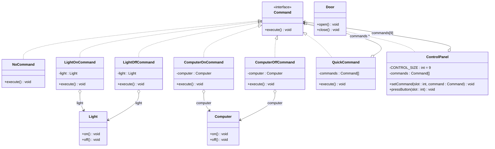
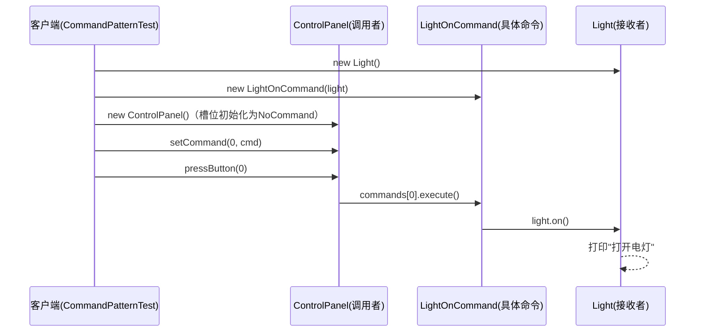

# 命令模式（Command Pattern）详细分析

## 一、模式概述

### 1.1 定义

命令模式（Command Pattern）是一种**行为型设计模式**，它将一个请求（请求 = "做什么"）封装成一个对象，从而使你可以用不同的请求对客户进行参数化；对请求排队或记录请求日志，以及支持可撤销的操作。

### 1.2 核心思想

本模块以"家电控制面板"为业务场景：

- **传统方式**：控制面板（调用者）直接调用电灯、电脑（接收者）的 `on()/off()` 方法，调用者与接收者**强耦合**。
- **命令模式**：把"开灯"、"关电脑"这类请求封装成一个个**命令对象（Command）**，控制面板只认识 `Command` 接口，不关心命令背后操作的是什么设备、怎么操作。

一句话总结：**把"动作请求"从"动作执行者"身上剥离出来，变成可以自由传递、组装、存储的独立对象。**

## 二、模式角色与本模块类对照

| 设计模式角色 | 本模块对应类 | 职责说明 |
|-------------|-------------|---------|
| Command（抽象命令接口） | `Command` | 定义命令的统一契约：`execute()` |
| ConcreteCommand（具体命令） | `LightOnCommand`、`LightOffCommand`、`ComputerOnCommand`、`ComputerOffCommand` | 持有接收者引用，将请求委托给接收者执行 |
| MacroCommand（宏命令/组合命令） | `QuickCommand` | 持有一组命令，执行时批量执行（命令模式 + 组合模式） |
| Null Command（空命令） | `NoCommand` | 空实现，充当默认命令，避免空指针判断（空对象模式） |
| Invoker（调用者） | `ControlPanel` | 持有命令数组，负责接收按钮请求并调用命令执行 |
| Receiver（接收者） | `Light`、`Computer`、`Door` | 真正执行动作的业务对象 |
| Client（客户端） | `CommandPatternTest` | 组装命令与接收者，并把命令绑定到控制面板 |

## 三、类图结构



> 说明：`ControlPanel` 持有 9 个命令槽位（数组下标 0~8），构造时全部初始化为 `NoCommand` 空命令；`QuickCommand` 自身也是 `Command`，因此宏命令可以像普通命令一样被塞进面板的任意槽位。

## 四、源码逐类详解

### 4.1 Command —— 抽象命令接口

```java
public interface Command {
    void execute();
}
```

- 整个模式的核心契约，仅一个 `execute()` 方法，语义是"执行该命令所封装的请求"。
- 调用者 `ControlPanel` 只依赖此接口，实现**面向接口编程**，与所有具体设备彻底解耦。

### 4.2 ControlPanel —— 调用者（命令的持有者与触发者）

```java
public class ControlPanel {
    private static final int CONTROL_SIZE = 9;
    private Command[] commands;

    public ControlPanel() {
        commands = new Command[CONTROL_SIZE];
        for (int i = 0; i < CONTROL_SIZE; i++) {
            commands[i] = new NoCommand();  // 槽位默认填充空命令
        }
    }

    public void setCommand(int slot, Command command) {
        commands[slot] = command;
    }

    public void pressButton(int slot) {
        commands[slot].execute();
    }
}
```

关键设计点：

1. **命令数组 + 槽位（slot）**：面板有 9 个按键槽位，`setCommand` 负责绑定命令，`pressButton` 负责触发执行——完美模拟物理控制面板的"按键 → 动作"模型。
2. **构造时全部填充 `NoCommand`**：这是**空对象模式（Null Object Pattern）**的应用，`pressButton` 中无需写 `if (commands[slot] != null)` 判空逻辑，未绑定的按键按下时静默无副作用。
3. **调用者极度"无知"**：面板不知道电灯、电脑的存在，只知道"槽位里有个命令，按下去就 execute"。新增设备类型对它零侵入。

### 4.3 NoCommand —— 空命令（空对象模式）

```java
public class NoCommand implements Command {
    @Override
    public void execute() {
        // 空实现，什么都不做
    }
}
```

- 避免调用者做空判断，消除 `NullPointerException` 风险。
- 语义上表示"该槽位尚未配置命令"，是命令模式的标准配套手法。

### 4.4 具体命令（以 LightOnCommand 为例，其余同理）

```java
public class LightOnCommand implements Command {
    private Light light;   // 持有接收者引用

    public LightOnCommand(Light light) {
        this.light = light;
    }

    @Override
    public void execute() {
        light.on();        // 将请求委托给接收者执行
    }
}
```

四个具体命令结构完全对称：

| 命令类 | 持有的接收者 | execute() 委托调用 |
|--------|-------------|-------------------|
| `LightOnCommand` | `Light` | `light.on()` |
| `LightOffCommand` | `Light` | `light.off()` |
| `ComputerOnCommand` | `Computer` | `computer.on()` |
| `ComputerOffCommand` | `Computer` | `computer.off()` |

每个命令封装的是**一个接收者 + 一个具体动作**的组合，这就是"请求被对象化"的体现。

### 4.5 QuickCommand —— 宏命令（命令模式 + 组合模式）

```java
public class QuickCommand implements Command {
    private Command[] commands;   // 持有一组命令

    public QuickCommand(Command[] commands) {
        this.commands = commands;
    }

    @Override
    public void execute() {
        for (Command command : commands) {
            command.execute();   // 依序批量执行
        }
    }
}
```

- 本模块的**精华所在**：宏命令本身实现了 `Command` 接口，内部却聚合了 `Command[]`，形成了**"命令套命令"的树形组合结构**——这正是命令模式与组合模式的经典结合。
- 对外表现为一个普通命令（可放进面板槽位、可再被别的宏命令包含），对内则批量执行一组子命令。
- 语义即"一键搞定"：按下一个按钮，开灯、关灯、开电脑、关电脑依序完成。
- 宏命令中的子命令顺序敏感，当前为串行同步执行。

### 4.6 接收者（Light / Computer / Door）

```java
public class Light {
    public void on()  { System.out.println("打开电灯"); }
    public void off() { System.out.println("关闭电灯"); }
}
```

- 接收者只关心自己的业务动作，完全不知道命令和面板的存在，**依赖方向是单向的（命令 → 接收者）**。
- `Door` 提供了 `open()/close()`，但目前**没有任何具体命令包装它**，属于预留的扩展点：新增 `DoorOpenCommand` / `DoorCloseCommand` 即可让门接入面板，无需改动任何既有代码。

## 五、执行流程分析（时序）



完整调用链：**客户端 → 调用者 → 命令对象 → 接收者**。请求的发起（按键）与请求的执行（设备动作）被命令对象从中隔开，调用者与接收者互不知晓对方存在。

## 六、测试验证（CommandPatternTest）

```java
ControlPanel controlPanel = new ControlPanel();
controlPanel.setCommand(0, new LightOnCommand(light));
controlPanel.setCommand(1, new LightOffCommand(light));
controlPanel.setCommand(2, new ComputerOnCommand(computer));
controlPanel.setCommand(3, new ComputerOffCommand(computer));

controlPanel.pressButton(0);
controlPanel.pressButton(1);
controlPanel.pressButton(2);
controlPanel.pressButton(3);

QuickCommand quickCommand = new QuickCommand(new Command[]{
        new LightOnCommand(light), new LightOffCommand(light),
        new ComputerOnCommand(computer), new ComputerOffCommand(computer)});
quickCommand.execute();
```

测试分两步验证：

1. **单命令绑定执行**：4 个槽位各绑定一条命令，逐个按键触发，验证基本请求-执行链路。
2. **宏命令批量执行**：将 4 条命令打包进 `QuickCommand`，一次 `execute()` 依序全部执行，验证组合能力。

运行输出：

```text
打开电灯
关闭电灯
打开电脑
关闭电脑
****点击一键搞定按钮****
打开电灯
关闭电灯
打开电脑
关闭电脑
```

## 七、设计亮点总结

1. **请求对象化（ encapsulation of request）**："开灯"从一个方法调用 `light.on()` 变成了一个可以传递、存储、组装的对象 `new LightOnCommand(light)`，这是命令模式的本质。
2. **空对象模式配合**：`NoCommand` 让调用者彻底摆脱判空负担，是教科书级的组合运用。
3. **组合模式协同（宏命令）**：`QuickCommand` 演示了命令模式最强大的扩展形态之一——宏命令/批量命令，"一键搞定"需求零成本实现。
4. **槽位绑定模型**：命令与面板槽位在运行时动态绑定（`setCommand`），实现了请求的可配置化。
5. **依赖倒置**：调用者依赖 `Command` 抽象而非具体设备，符合依赖倒置原则（DIP）。

## 八、优缺点分析

### 优点

- **解耦调用者与接收者**：调用者无需知道接收者的任何细节，也无需知道命令的执行细节。
- **扩展性好（符合开闭原则）**：新增设备/动作只需新增"接收者 + 具体命令"，例如接入 `Door`，全部通过扩展完成，既有代码零修改。
- **命令可自由组合**：通过宏命令实现命令的组合编排；命令对象也可以被序列化、入队、记日志。
- **天然支持高级特性**：在此基础上可平滑扩展出**撤销/重做（undo/redo）、请求排队、任务队列、事务日志、线程池任务提交**等能力。

### 缺点

- **类数量膨胀**：每增加一个动作就要新增一个命令类（本模块 2 个设备已产生 4 个命令类），系统复杂度上升。
- **间接调用开销**：请求需经过"调用者 → 命令 → 接收者"三层，存在额外的对象创建与方法转发成本。
- **简单场景过度设计**：若调用者与接收者关系固定且不会变化，直接调用更简洁，强行套命令模式属于画蛇添足。

## 九、适用场景

- 需要将请求参数化为对象并在不同时刻执行（如**线程池任务、消息队列、定时任务**——`Runnable/Callable` 正是 JDK 中命令模式的体现）。
- 需要**撤销/重做**功能的系统（编辑器、绘图软件的 Ctrl+Z）。
- 需要**命令编排、批处理、流水线**的场景（本模块的 `QuickCommand` 即雏形）。
- 需要**记录操作日志、审计、事务回滚**（命令对象可携带执行前状态以便恢复）。
- GUI 系统：按钮、菜单项、快捷键统一绑定到命令对象（本模块的 `ControlPanel` 槽位即此模型的缩影）。

## 十、可扩展方向（基于当前代码）

1. **撤销支持**：在 `Command` 接口增加 `undo()` 方法，每个具体命令记录执行前的状态，`ControlPanel` 增加撤销按键，即可实现"按错了回退"。
2. **接收者补全**：为 `Door` 编写 `DoorOpenCommand` / `DoorCloseCommand`，填入槽位 4、5，验证"零修改扩展"。
3. **命令日志与恢复**：将每次 `pressButton` 的命令对象记录到队列/日志，系统崩溃后重放（redo）日志即可恢复现场。
4. **异步执行**：把 `pressButton` 中的 `execute()` 交给线程池执行，命令模式天然适配，调用者无感知。
5. **更复杂的组合**：让 `QuickCommand` 支持"宏命令嵌套宏命令"，形成命令树。

## 十一、与其他模式的关系

| 模式 | 关系 |
|------|------|
| **组合模式（Composite）** | `QuickCommand` 聚合命令数组即组合模式的应用；组合重在"对象结构"，命令重在"行为封装" |
| **策略模式（Strategy）** | 结构几乎相同（都是接口 + 多实现），区别在语义：策略描述"怎么做一件事的可替换算法"，命令描述"做什么的请求封装" |
| **备忘录模式（Memento）** | 实现撤销（undo）时，命令常与备忘录配合记录接收者状态 |
| **原型模式（Prototype）** | 需要大量复制历史命令时，可用原型模式克隆命令对象 |
| **空对象模式（Null Object）** | `NoCommand` 即空对象模式在命令模式中的标准落地 |

## 十二、JDK / 框架中的命令模式

- `java.lang.Runnable` / `java.util.concurrent.Callable`：线程任务即命令对象，`Thread`/线程池是调用者。
- `java.util.function.Consumer` 等函数式接口：函数对象是命令模式的现代轻量化形态（方法引用可替代大部分简单命令类）。
- Spring 的 `RequestMappingHandlerMapping` 将 HTTP 请求映射为 `HandlerMethod` 命令对象再执行；`JdbcTemplate` 的 `StatementCallback` 亦是命令思想的体现。
- Swing/AWT 的 `Action`、`ActionListener` 事件处理模型。
