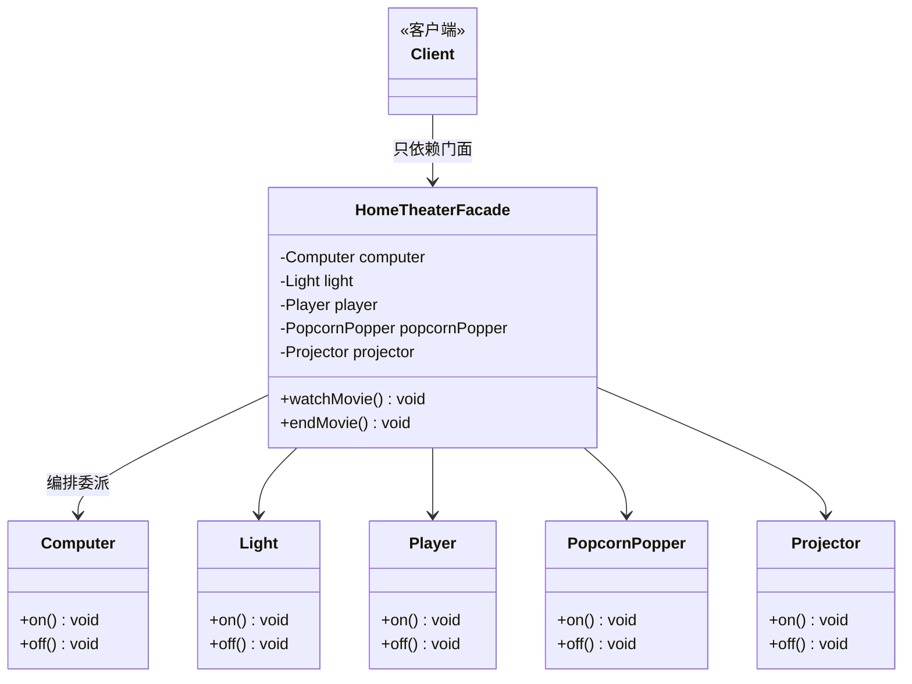
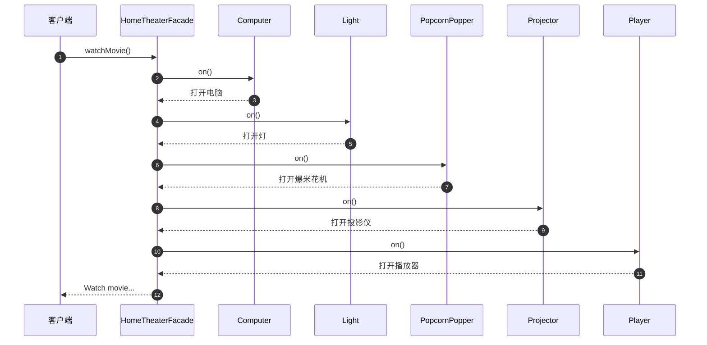

# 外观模式（Facade Pattern，又称门面模式）学习记录

> 结构型设计模式之一。本目录以「家庭影院一键观影」为例进行学习。

---

## 一、模式定义与核心意图

**定义**：外观模式为一个复杂的子系统提供一个统一的、简化的高层接口，使得客户端无需了解子系统内部的复杂细节，只需通过外观类即可完成对子系统的使用。

**核心意图**：
- 为一组复杂子系统提供一致、简化的入口，**简化客户端与子系统之间的交互**。
- 客户端**只认识门面，不认识内部设备**，从而降低客户端与子系统的耦合度。
- 门面只是「简化入口」，并不阻止客户端绕过门面直接使用子系统——它是一道「便捷之门」，而非「一堵墙」。

**一句话理解**：像一键开关的智能音箱——你说"我要看电影"，它自动开电脑、开投影、开音响、调灯光，而你不需要逐个摆弄每个设备。

---

## 二、它解决的实际问题

假设没有门面，客户端想看一场电影，就得自己动手编排一堆设备的启动顺序：

```java
// 客户端直接面对 5 个设备，代码又臭又长
computer.on();
light.on();
popcornPopper.on();
projector.on();
player.on();
// ……看完还得逐个关掉，再来一遍
```

由此带来的问题：

| 问题 | 说明 |
|------|------|
| 客户端负担重 | 必须了解所有子设备的接口和调用顺序 |
| 耦合度过高 | 客户端与每个子系统都直接依赖，任何设备接口变化都要改客户端 |
| 操作易出错 | 步骤多、顺序敏感，漏开、漏关难以避免 |
| 逻辑无法复用 | 同样的启动流程在多个客户端中要重复编写 |

外观模式把这套「开机流程」封装到门面类的一个方法里，客户端一行代码搞定。

---

## 三、角色构成与各自职责

| 角色 | 说明 | 本示例对应 |
|------|------|-----------|
| 外观类（Facade） | 知道哪些子系统负责处理请求，把客户端的请求委派给相应的子系统对象；对外提供简化的高层方法 | `HomeTheaterFacade`（家庭影院门面，提供 `watchMovie()` / `endMovie()` 两个一键方法） |
| 子系统类（Subsystem） | 实现子系统的具体功能，处理外观类指派的任务；**不知道外观类的存在**，也没有任何指向外观的引用 | `device` 包下的 5 个设备类：`Computer`（电脑）、`Light`（灯光）、`Player`（播放器）、`PopcornPopper`（爆米花机）、`Projector`（投影仪） |

**包结构对应**：

```
facadePattern
├── theater
│   └── HomeTheaterFacade.java   ← 外观类（Facade）
└── device
    ├── Computer.java            ← 子系统类（Subsystem）
    ├── Light.java
    ├── Player.java
    ├── PopcornPopper.java
    └── Projector.java
```

**类图**：



> 注意箭头方向：门面**单向依赖**子系统，子系统对门面一无所知——这是外观模式与中介者模式的本质区别之一。

---

## 四、角色之间的协作流程

1. **客户端创建子系统对象**，并全部注入外观类的构造器。
2. **客户端调用外观类的简化方法**（如 `watchMovie()`），不再关心内部细节。
3. **外观类把请求翻译、编排**，按顺序调用各子系统的具体方法（`on()`）。
4. **子系统各自完成本职工作**，它们完全不知道门面的存在。
5. 需要结束场景时，客户端调用 `endMovie()`，门面再统一下发关闭指令。

**时序图**：



---

## 五、与目录中示例代码的对应关系

### 1. 子系统类 —— `device/Computer.java`（其余 4 个设备类结构相同）

```java
public class Computer {
    public void on() {
        System.out.println("打开电脑");
    }
    public void off() {
        System.out.println("关闭电脑");
    }
}
```

> 每个设备类只关心自己的开关逻辑，互相之间零依赖，也不知道有门面存在。

### 2. 外观类 —— `theater/HomeTheaterFacade.java`

```java
public class HomeTheaterFacade {

    private Computer computer;
    private Light light;
    private Player player;
    private PopcornPopper popcornPopper;
    private Projector projector;

    // 通过构造器聚合所有子系统对象
    public HomeTheaterFacade(Computer computer, Light light, Player player,
                             PopcornPopper popcornPopper, Projector projector) {
        this.computer = computer;
        this.light = light;
        this.player = player;
        this.popcornPopper = popcornPopper;
        this.projector = projector;
    }

    public void watchMovie() {   // 一键观影：编排所有开启动作
        computer.on();
        light.on();
        popcornPopper.on();
        projector.on();
        player.on();
        System.out.println("Watch movie...");
    }

    public void endMovie() {     // 一键收场：编排所有关闭动作
        computer.off();
        light.off();
        popcornPopper.off();
        projector.off();
        player.off();
        System.out.println("End movie...");
    }
}
```

### 3. 客户端使用方式

```java
HomeTheaterFacade theater = new HomeTheaterFacade(
        new Computer(), new Light(), new Player(),
        new PopcornPopper(), new Projector());

theater.watchMovie();   // 客户端只需认识门面这一个类
theater.endMovie();
```

**运行结果**：

```
打开电脑
打开灯
打开爆米花机
打开投影仪
打开播放器
Watch movie...
关闭电脑
关闭灯
关闭爆米花机
关闭投影仪
关闭播放器
End movie...
```

**要点**：
- 门面通过**构造器注入**持有全部子系统引用，属于聚合关系。
- 客户端从「认识 5 个类、记住 10 个方法」简化为「认识 1 个类、记住 2 个方法」。
- 若哪天观影流程变化（比如需要先拉窗帘），只需修改 `watchMovie()` 内部实现，客户端代码完全不动。

---

## 六、优点与缺点

### 优点

1. **降低耦合**：客户端与子系统解耦，只依赖门面，子系统内部变化不影响客户端。
2. **简化使用**：屏蔽复杂细节，把"一步步操作"变成"一个方法调用"。
3. **流程集中、便于复用**：设备启动/关闭的编排逻辑集中在一处，多个客户端可复用。
4. **符合迪米特法则**：客户端只与直接朋友（门面）通信，不与陌生类（子系统）打交道。

### 缺点

1. **可能违反开闭原则**：新增或调整子系统行为时，往往需要修改门面类本身（如本例新增设备要改构造器和 `watchMovie()`）。
2. **门面易膨胀成"上帝类"**：所有业务流程都塞进门面，日积月累会变得臃肿。
3. **降低了灵活性（对普通用户而言）**：默认走门面的标准流程，特殊需求仍需绕过门面直接操作子系统。

---

## 七、典型适用场景与业务识别清单

### 典型场景

1. **为复杂子系统提供简单入口**：子系统类多、调用步骤繁琐时（如本例的家庭影院）。
2. **分层系统中作为层与层之间的入口**：如 Service 层作为 Controller 与多个 DAO 之间的门面。
3. **第三方库的封装**：将外部 SDK 的复杂 API 包装成符合自己业务语义的简单方法。
4. **系统间集成**：多个内部系统通过统一对外的门面服务暴露能力，减少外部系统的感知面。

### 业务识别清单（遇到这些情况就想想外观模式）

以后写代码时，出现下面任意一条信号，就该考虑用外观模式了：

| # | 业务信号 | 对应方案 |
|---|---------|---------|
| 1 | 一个按钮/一个接口的"保存"要**同时操作多张表、调用多个模块**（如一键提交、一键审核、一键结算） | 把整套流程封装进门面的一个方法 |
| 2 | Controller 方法越来越长，**连续注入并调用多个 Service/DAO**，像个"脚本" | 在 Service 层收敛为一个门面方法，Controller 只调它 |
| 3 | 对接第三方 SDK，**API 又多又乱**（初始化、签名、拼参、发请求、解析、关连接……） | 写一个 XxxClient 门面，对外只暴露业务语义的方法 |
| 4 | 子系统**演进频繁**（换库、重构），不想让调用方跟着改 | 调用方只认门面，内部随便换 |
| 5 | 需要向外部系统**提供能力**，但不想暴露内部类和包结构 | 暴露一个门面接口，藏住实现 |
| 6 | 新老系统迁移，想先给**老调用方一个统一兼容入口** | 用门面收口，内部再逐步切到新系统 |
| 7 | 遗留代码难以重构，想让新代码**不再继续恶化依赖** | 新代码统一走新建的门面，老代码逐步迁入 |

> **识别口诀**：客户端"啰嗦"（要管一堆对象和顺序）→ 该收口了；模块"害羞"（不想被外界看清内部）→ 该挡一层了。

---

## 八、JDK 与主流框架中的真实应用

外观模式是框架里出镜率最高的结构型模式之一，读源码时随处可见：

| 框架/类 | 门面是谁 | 屏蔽了什么 |
|---------|---------|-----------|
| **SLF4J** | `LoggerFactory.getLogger()` 返回的 `Logger` | 名字里就带 Facade（Simple **Logging Facade** for Java）。上层只调 `info()/error()`，底层用 Logback 还是 Log4j2 随便换 |
| **Spring JDBC** | `JdbcTemplate` | 原生 JDBC 要手动拿 `Connection`、建 `Statement`、遍历 `ResultSet`、按序 close、处理受检异常；`JdbcTemplate` 一句 `queryForObject()` 全包了 |
| **Spring 事务** | `TransactionTemplate` / `@Transactional` | 手动 `getTransaction()/commit()/rollback()` 的繁琐协议，被一个模板方法/注解收口 |
| **Tomcat** | `RequestFacade`（包装内部 `Request`） | Servlet 规范官方示例级门面：防止外部拿到 Catalina 内部 Request 引用越权篡改，只暴露标准 `HttpServletRequest` 接口 |
| **MyBatis** | `SqlSession` | 对 `Executor`、`StatementHandler`、`ResultSetHandler`、插件拦截链的整体门面，`selectList()` 一句顶一串 |
| **JDK** | `java.net.URL#openConnection()` | 一个 URL 背后隐藏了 DNS 解析、TCP 三次握手、协议处理器选择、流建立等一大堆细节 |
| **自身项目** | 三层架构里的 **Service 层** | Controller 不直接碰 DAO/外部接口，Service 就是天然的"业务门面"——这正是本模式在日常开发中最普遍的形态 |

> 学习建议：下次看框架源码时，凡是名字里带 `Facade`、`Template`、`Session`、`Context` 的类，先想想它替你挡住了哪些复杂度。

---

## 九、真实业务场景示例（学以致用）

以常见的「下单」为例：一次下单要扣库存、扣余额、存订单、发通知。没有门面时 Controller 苦不堪言；有门面后收口成一个方法。

```java
// ---------- 子系统：各自单一职责，互不知道彼此 ----------

// 订单数据访问：只管订单表
public class OrderDao {
    public void saveOrder(Order order) { /* INSERT order ... */ }
}

// 库存数据访问：只管库存表
public class StockDao {
    public void deductStock(String sku, int count) { /* UPDATE stock ... */ }
}

// 账户服务：只管余额
public class AccountService {
    public void deductBalance(String userId, BigDecimal amount) { /* ... */ }
}

// 通知服务：只管发消息
public class NoticeService {
    public void sendOrderSuccess(String userId) { /* ... */ }
}

// ---------- 门面：客户端只认识它 ----------

public class OrderFacade {

    private final OrderDao orderDao;
    private final StockDao stockDao;
    private final AccountService accountService;
    private final NoticeService noticeService;

    // 构造器注入全部子系统（Spring 中直接 @Autowired）
    public OrderFacade(OrderDao orderDao, StockDao stockDao,
                       AccountService accountService, NoticeService noticeService) {
        this.orderDao = orderDao;
        this.stockDao = stockDao;
        this.accountService = accountService;
        this.noticeService = noticeService;
    }

    // 一键下单：编排各子系统，方法名用业务语言命名
    public void placeOrder(Order order) {
        stockDao.deductStock(order.getSku(), order.getCount());
        accountService.deductBalance(order.getUserId(), order.getAmount());
        orderDao.saveOrder(order);
        noticeService.sendOrderSuccess(order.getUserId());
    }
}

// ---------- 客户端（Controller）：一行搞定 ----------

OrderFacade facade = new OrderFacade(orderDao, stockDao, accountService, noticeService);
facade.placeOrder(order);
```

同类业务场景还有：

- **医院系统**：提交会诊申请 = 保存申请单 + 校验患者状态 + 通知受邀科室 + 写操作日志
- **出院结算**：一键结算 = 生成结算单 + 更新费用状态 + 扣减药品库存 + 开发票 + 发短信
- **文件导入**：一键导入 = 解析 Excel + 逐行校验 + 批量入库 + 生成导入报告

---

## 十、手写外观模式的固定步骤

以后确认要用外观模式时，按这五步走：

1. **拆子系统**：把复杂流程按单一职责拆成若干子系统类/模块（每个类只做一件事，互不引用）。
2. **验证子系统独立性**：子系统之间不互相依赖，更不知道门面存在；必要时先让它们只依赖抽象。
3. **建门面类**：新建一个门面，通过构造器注入（或 Spring 注入）持有需要的子系统引用。
4. **写编排方法**：用**业务动词**命名方法（`watchMovie`、`placeOrder`、`settleDischarge`），内部按正确顺序委派子系统，可附加少量流程性逻辑（顺序、汇总），但真正的业务规则应下沉到子系统。
5. **客户端只认门面**：新代码一律走门面；确有细粒度需求时才允许绕过门面直连子系统（外观模式不禁止这样做）。

---

## 十一、常见误区与最佳实践

| 误区 | 正确做法 |
|------|---------|
| 门面里写满了业务规则，变成"上帝类" | 门面只做**编排与收口**，业务规则下沉到子系统；一个领域一个门面，别做万能门面 |
| 给门面套接口，强迫所有子系统实现同一接口 | 门面不需要统一子系统接口（那是适配器/策略的职责），门面聚合的是**不同的类** |
| 认为加了门面就不能直连子系统 | 门面是"便捷之门"不是"一堵墙"，精细控制场景允许绕过 |
| 子系统反向调用门面，形成双向依赖 | 子系统必须对门面无感知，依赖永远单向：门面 → 子系统 |
| 一个门面从头管到尾，几十年不动 | 子系统大变时可以换门面/加新门面，旧门面做兼容转发，保持老调用方不动 |

---

## 十二、与其他相关模式的简要对比（复习用）

| 对比项 | 外观模式 | 适配器模式 | 装饰器模式 | 代理模式 |
|--------|---------|-----------|-----------|---------|
| 目的 | **简化**复杂子系统的使用 | **转换**不兼容的接口 | 动态**增强**对象功能 | **控制**对原对象的访问 |
| 接口关系 | 门面对外暴露**新的简化接口** | 适配器把原接口**换成**目标接口 | 装饰器与被装饰者**接口相同** | 代理与被代理者**接口相同** |
| 对象数量 | 一个门面通常包装**多个**子系统 | 通常只围绕**一个**被适配对象 | 一层一层包裹，可叠加**多层** | 通常只代理**一个**对象 |
| 典型场景 | 一键开启家庭影院 | 让旧系统适配新接口 | 装备镶嵌宝石加攻击力 | 远程代理、缓存代理 |

> 记忆口诀：**外观求"简"，适配求"通"，装饰求"增"，代理求"控"**。
