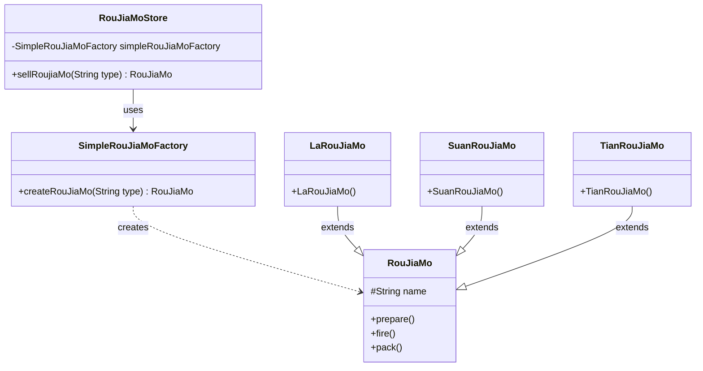
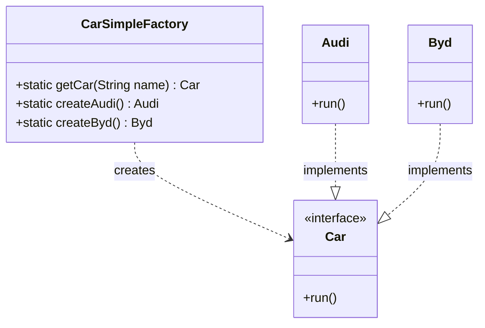
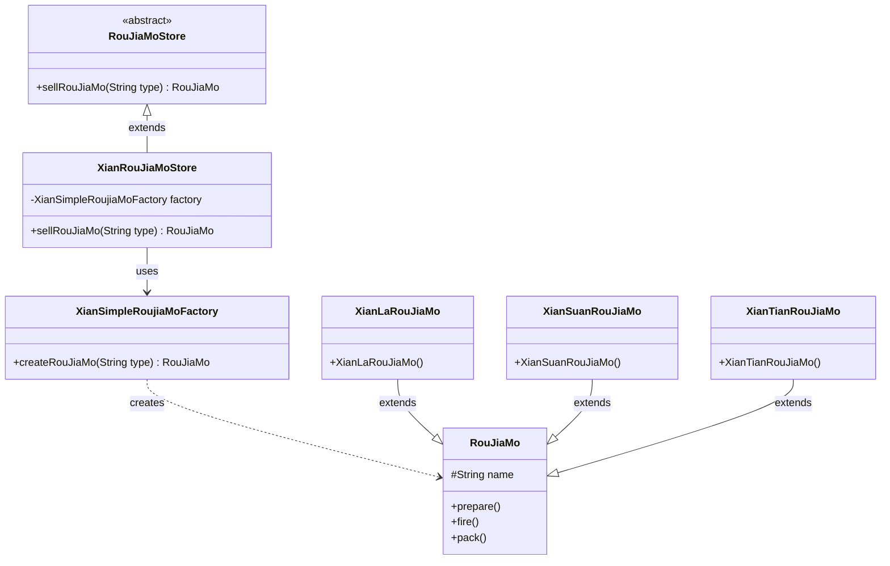
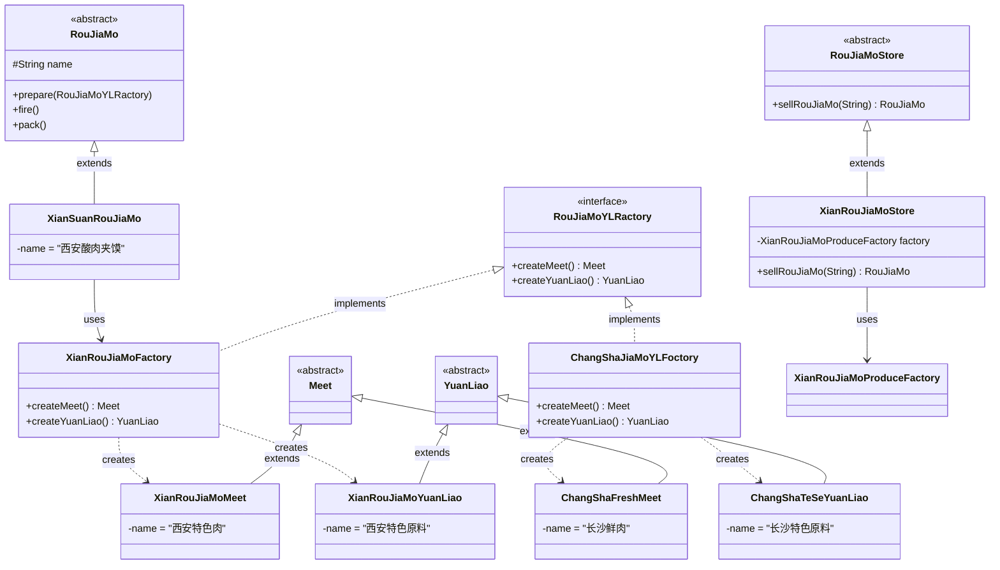

# 工厂模式设计分析

## 目录
- [一、概述](#一概述)
- [二、简单工厂模式（Simple Factory）](#二简单工厂模式simple-factory)
- [三、静态工厂模式（Static Factory）](#三静态工厂模式static-factory)
- [四、工厂方法模式（Factory Method）](#四工厂方法模式factory-method)
- [五、抽象工厂模式（Abstract Factory）](#五抽象工厂模式abstract-factory)
- [六、模式演进与对比](#六模式演进与对比)
- [七、总结](#七总结)

---

## 一、概述

### 1.1 什么是工厂模式

工厂模式（Factory Pattern）是面向对象设计模式中最常用的一种创建型模式。它的核心思想是将对象的创建与使用分离，通过一个"工厂"类来负责创建具体的产品对象，而不是由客户端直接实例化产品类。

### 1.2 为什么需要工厂模式

在没有使用工厂模式的情况下，客户端代码直接依赖具体的产品类：

```java
// ❌ 违反依赖倒置原则
RouJiaMo roujiaMo = new SuanRouJiaMo();
```

这种方式存在以下问题：
- **紧耦合**：客户端代码与具体产品类强耦合
- **违背开闭原则**：新增产品需要修改客户端代码
- **职责不清晰**：客户端应该关注"使用"而非"创建"

使用工厂模式后：

```java
// ✅ 依赖抽象，客户端不关心具体实现
RouJiaMo roujiaMo = simpleFactory.createRouJiaMo("SuanRouJiaMo");
```

### 1.3 三种工厂模式的关系

本代码库展示了工厂模式的演进过程：

```
简单工厂（Simple Factory）
    ↓ 演进
工厂方法（Factory Method）
    ↓ 演进
抽象工厂（Abstract Factory）
```

**核心区别：**
- **简单工厂**：一个工厂类创建所有产品（集中管理）
- **工厂方法**：每个产品对应一个工厂（子类决定实例化）
- **抽象工厂**：每个产品族对应一个工厂（产品族一致性）

---

## 二、简单工厂模式（Simple Factory）

### 2.1 模式定义

简单工厂模式又称为静态工厂模式（注意：这里指的不是Java中的Static Factory），它由一个工厂类根据传入的参数决定创建哪一种产品类的实例。

### 2.2 代码结构分析

**目录结构：**
```
simpleFactory/
├── constant/
│   └── RouJiaMoConstant.java          # 常量类
├── factory/
│   └── SimpleRouJiaMoFactory.java   # 简单工厂类
├── product/
│   ├── RouJiaMo.java                 # 抽象产品类
│   ├── LaRouJiaMo.java               # 具体产品：辣肉夹馍
│   ├── SuanRouJiaMo.java             # 具体产品：酸肉夹馍
│   └── TianRouJiaMo.java             # 具体产品：甜肉夹馍
└── store/
    └── RouJiaMoStore.java            # 商店类（使用者）
```

### 2.3 类关系图



### 2.4 核心角色说明

#### 1. 抽象产品（Product）
**类名：** `RouJiaMo`（肉夹馍）

**作用：** 定义产品的公共接口，所有具体产品必须实现这个抽象类。

```java
public abstract class RouJiaMo {
    protected String name;
    
    public void prepare() {
        System.out.println(name + "揉面-剁肉-完成准备工作");
    }
    
    public void fire() {
        System.out.println(name + "肉夹馍-专用设备-烘烤");
    }
    
    public void pack() {
        System.out.println(name + "肉夹馍-专用袋-包装");
    }
}
```

**设计原则体现：** 抽象产品类体现了**面向接口编程**的原则，具体产品继承通用的行为。

#### 2. 具体产品（Concrete Product）

**类名：**
- `LaRouJiaMo`（辣肉夹馍）
- `SuanRouJiaMo`（酸肉夹馍）
- `TianRouJiaMo`（甜肉夹馍）

**作用：** 实现或继承抽象产品类，提供具体的产品实现。

```java
public class LaRouJiaMo extends RouJiaMo {
    public LaRouJiaMo() {
        this.name = "辣肉夹馍";
    }
}
```

**设计细节：** 具体产品类非常简洁，只需要设置产品名称，因为通用流程（prepare、fire、pack）已经在父类中实现。

#### 3. 工厂类（Factory）

**类名：** `SimpleRouJiaMoFactory`（简单肉夹馍工厂）

**作用：** 根据传入的类型参数，创建对应的具体产品实例。

```java
public class SimpleRouJiaMoFactory {
    public RouJiaMo createRouJiaMo(String type) {
        RouJiaMo roujiaMo = null;
        if (RouJiaMoConstant.SUAN_ROU_JIA_MO.equals(type)) {
            roujiaMo = new SuanRouJiaMo();
        } else if (RouJiaMoConstant.LA_ROU_JIA_MO.equals(type)) {
            roujiaMo = new LaRouJiaMo();
        } else if (RouJiaMoConstant.TIAN_ROU_JIA_MO.equals(type)) {
            roujiaMo = new TianRouJiaMo();
        }
        return roujiaMo;
    }
}
```

**关键设计点：**
- **依赖常量类**：`RouJiaMoConstant` 定义了所有类型常量，避免硬编码字符串
- **返回抽象类型**：返回的是 `RouJiaMo` 而不是具体类型，遵循**里氏替换原则**
- **使用 `equals()` 比较**：使用常量调用 `equals()` 方法，避免空指针异常

#### 4. 常量类（Constant）

**类名：** `RouJiaMoConstant`

**作用：** 集中管理所有类型常量，便于维护和修改。

```java
public class RouJiaMoConstant {
    public static final String SUAN_ROU_JIA_MO = "SuanRouJiaMo";
    public static final String LA_ROU_JIA_MO = "LaRouJiaMo";
    public static final String TIAN_ROU_JIA_MO = "TianRouJiaMo";
}
```

**设计原则：** 使用常量类体现了**DRY（Don't Repeat Yourself）原则**和**单一职责原则**。

#### 5. 客户端（Client）

**类名：** `RouJiaMoStore`（肉夹馍商店）

**作用：** 使用工厂类创建产品，不直接与具体产品类耦合。

```java
public class RouJiaMoStore {
    private SimpleRouJiaMoFactory simpleRouJiaMoFactory;
    
    public RouJiaMoStore(SimpleRouJiaMoFactory simpleRouJiaMoFactory) {
        this.simpleRouJiaMoFactory = simpleRouJiaMoFactory;
    }
    
    public RouJiaMo sellRoujiaMo(String type) {
        RouJiaMo roujiaMo = simpleRouJiaMoFactory.createRouJiaMo(type);
        roujiaMo.prepare();
        roujiaMo.fire();
        roujiaMo.pack();
        return roujiaMo;
    }
}
```

**关键设计点：**
- **依赖注入**：通过构造函数注入工厂实例，降低耦合度
- **模板方法模式**：`sellRoujiaMo` 方法定义了固定的销售流程（准备→烘烤→包装）
- **控制反转**：创建对象的职责从客户端转移到工厂类

### 2.5 调用流程

```
客户端（RouJiaMoStore）
    ↓ 调用 sellRoujiaMo("SuanRouJiaMo")
工厂类（SimpleRouJiaMoFactory）
    ↓ 调用 createRouJiaMo("SuanRouJiaMo")
    ↓ 创建 new SuanRouJiaMo()
具体产品（SuanRouJiaMo）
    ↓ 返回 RouJiaMo 抽象类型
客户端继续调用 prepare()、fire()、pack()
```

### 2.6 优缺点分析

#### ✅ 优点

1. **实现了对象创建与使用的分离**
   - 客户端不需要知道具体产品类的创建过程
   - 只需关心产品的使用

2. **集中管理产品创建逻辑**
   - 所有创建逻辑集中在一个类中
   - 便于维护和修改

3. **减少代码重复**
   - 避免在多处重复 `new XXX()` 的代码

4. **提高代码可读性**
   - `factory.createRouJiaMo("Suan")` 比 `new SuanRouJiaMo()` 更清晰

#### ❌ 缺点

1. **违背开闭原则（OCP）**
   - 新增产品必须修改工厂类的 `createRouJiaMo` 方法
   - 代码需要修改才能支持新类型

2. **工厂类职责过重**
   - 所有产品创建逻辑集中在一个类中
   - 随着产品种类增加，工厂类会越来越庞大

3. **违反单一职责原则**
   - 工厂类既负责创建对象，又可能包含其他业务逻辑

### 2.7 实际应用场景

简单工厂模式适用于：
- **产品种类相对稳定**：不会频繁新增产品类型
- **创建逻辑简单**：创建过程不涉及复杂配置
- **客户端不需要关心创建细节**：只需获取产品实例

**示例场景：**
- 日志框架的 LoggerFactory
- JDBC 中的 DriverManager.getConnection()
- Java 反射中的 Class.newInstance()

---

## 三、静态工厂模式（Static Factory）

### 3.1 模式定义

静态工厂模式是简单工厂的一种变体，它将工厂类的方法声明为 `static`，可以直接通过类名调用，无需创建工厂实例。

### 3.2 代码结构分析

**目录结构：**
```
staticFactory/
├── constant/
│   └── CarConstant.java           # 常量类
├── factory/
│   └── CarSimpleFactory.java     # 静态工厂类
└── product/
    ├── Car.java                   # 抽象产品接口
    ├── Audi.java                  # 具体产品：奥迪
    └── Byd.java                   # 具体产品：比亚迪
```

### 3.3 类关系图



### 3.4 与简单工厂的区别

| 特性 | 简单工厂 | 静态工厂 |
|------|---------|---------|
| 方法类型 | 实例方法 | 静态方法 |
| 需要实例化 | ✅ 需要 `new SimpleFactory()` | ❌ 不需要 |
| 可实现接口 | ✅ 可以实现接口 | ❌ 无法实现接口 |
| 可被子类继承 | ✅ 可以被继承 | ❌ 无法被继承 |
| 可添加成员变量 | ✅ 可以 | ❌ 不可以 |
| 测试难度 | 容易 Mock | 难以 Mock |

### 3.5 核心代码分析

#### 1. 抽象产品接口

**类名：** `Car`（汽车接口）

```java
public interface Car {
    void run();
}
```

**设计点：** 这里使用接口而不是抽象类，体现了**针对接口编程而非实现编程**的原则。

#### 2. 具体产品

```java
public class Audi implements Car {
    @Override
    public void run() {
        System.out.println("奥迪运行");
    }
}

public class Byd implements Car {
    @Override
    public void run() {
        System.out.println("比亚迪运行");
    }
}
```

**设计点：** 具体产品通过实现接口的方式，提供了统一的行为规范。

#### 3. 静态工厂类

```java
public class CarSimpleFactory {
    
    // 方式1：统一的创建入口
    public static Car getCar(String name) throws Exception {
        if (CarConstant.AUDI.equals(name)) {
            return new Audi();
        } else if (CarConstant.BYD.equals(name)) {
            return new Byd();
        } else {
            throw new Exception("没有此车辆");
        }
    }
    
    // 方式2：每个产品对应一个静态方法
    public static Audi createAudi() {
        return new Audi();
    }
    
    public static Byd createByd() {
        return new Byd();
    }
}
```

**两种方式的对比：**

| 创建方式 | 优点 | 缺点 |
|---------|------|------|
| `getCar(name)` | 集中管理，调用方便 | 仍需判断逻辑 |
| `createAudi()` | 无需判断，语义清晰 | 方法数量与产品数量成正比 |

### 3.6 优缺点分析

#### ✅ 优点

1. **调用简单**
   - 无需创建工厂实例
   - 直接通过类名调用

2. **语义清晰**
   - 方法名可以表达创建意图
   - 如 `CarSimpleFactory.createAudi()` 比 `new Audi()` 更清晰

3. **可以返回原返回类型的子类型**
   - 静态工厂方法可以返回接口类型
   - 隐藏具体实现

4. **代码简洁**
   - 省去了创建工厂实例的步骤

#### ❌ 缺点

1. **无法被子类继承**
   - 静态方法无法被重写

2. **难以测试**
   - 无法使用 Mock 框架进行模拟
   - 紧耦合到具体工厂类

3. **与其他静态方法混淆**
   - 无法清晰地标识这是工厂方法
   - 建议：使用清晰的命名规范（如 `valueOf`、`create`、`newInstance`）

---

## 四、工厂方法模式（Factory Method）

### 4.1 模式定义

工厂方法模式是简单工厂的升级版，它定义了一个创建对象的接口，但由子类决定要实例化的类是哪一个。工厂方法让类的实例化推迟到子类。

### 4.2 代码结构分析

**目录结构：**
```
factoryMethod/
├── constant/
│   └── RouJiaMoConstant.java      # 常量类
├── factory/
│   └── XianSimpleRoujiaMoFactory.java  # 具体工厂类
├── product/
│   ├── RouJiaMo.java               # 抽象产品类
│   ├── XianLaRouJiaMo.java         # 具体产品：西安辣味肉夹馍
│   ├── XianSuanRouJiaMo.java       # 具体产品：西安酸味肉夹馍
│   └── XianTianRouJiaMo.java       # 具体产品：西安甜味肉夹馍
└── store/
    ├── RouJiaMoStore.java          # 抽象工厂类
    └── XianRouJiaMoStore.java      # 具体工厂实现：西安商店
```

### 4.3 类关系图



### 4.4 与简单工厂的核心区别

```
简单工厂模式：
┌─────────────────┐
│ SimpleFactory   │  ← 单一工厂类，所有产品都在这里创建
└────────┬────────┘
         │
    creates
         │
    ┌────┴────┬────────┐
    ▼         ▼        ▼
  LaRou   SuanRou   TianRou

工厂方法模式：
┌─────────────────┐
│ RouJiaMoStore   │  ← 抽象工厂，定义接口
│ (抽象类)         │
└────────┬────────┘
         │ extends
    ┌────┴────────────────┐
    ▼                     ▼
┌──────────────────┐  ┌──────────────────┐
│ XianRouJiaMoStore│  │ BeiJingStore     │  ← 具体工厂
│ (具体工厂)        │  │ (具体工厂)        │
└────────┬─────────┘  └────────┬─────────┘
         │                     │
         ▼                     ▼
┌──────────────────┐  ┌──────────────────┐
│ XianSimpleFactory │  │ BeiJingFactory   │  ← 每个工厂
└──────────────────┘  └──────────────────┘
```

**核心区别：**
- 简单工厂：**一个工厂**创建**多种产品**
- 工厂方法：**多个工厂**各自创建**自己的产品**

### 4.5 核心角色说明

#### 1. 抽象工厂（Creator）

**类名：** `RouJiaMoStore`（肉夹馍商店抽象类）

```java
public abstract class RouJiaMoStore {
    // 抽象方法：定义创建产品的接口
    public abstract RouJiaMo sellRouJiaMo(String type);
}
```

**作用：** 定义工厂的抽象接口，不负责具体产品的创建。

**设计原则：** 抽象工厂类体现了**依赖倒置原则（DIP）**：
- 高层模块（`RouJiaMoStore`）不应该依赖低层模块（具体工厂）
- 两者都应该依赖抽象（`RouJiaMo`）

#### 2. 具体工厂（Concrete Creator）

**类名：** `XianRouJiaMoStore`（西安肉夹馍商店）

```java
public class XianRouJiaMoStore extends RouJiaMoStore {
    
    private XianSimpleRoujiaMoFactory factory;
    
    public XianRouJiaMoStore(XianSimpleRoujiaMoFactory factory) {
        this.factory = factory;
    }
    
    @Override
    public RouJiaMo sellRouJiaMo(String type) {
        RouJiaMo rouJiaMo = factory.createRouJiaMo(type);
        rouJiaMo.prepare();
        rouJiaMo.fire();
        rouJiaMo.pack();
        return rouJiaMo;
    }
}
```

**关键设计点：**
- **继承抽象工厂**：西安商店继承自抽象商店
- **持有具体工厂**：西安商店持有西安工厂的实例
- **定义地区特色**：西安商店只卖西安口味的肉夹馍

**类名：** `XianSimpleRoujiaMoFactory`（西安简单肉夹馍工厂）

```java
public class XianSimpleRoujiaMoFactory {
    public RouJiaMo createRouJiaMo(String type) {
        RouJiaMo roujiaMo = null;
        if (RouJiaMoConstant.SUAN_ROU_JIA_MO.equals(type)) {
            roujiaMo = new XianLaRouJiaMo();  // 注意：这里应该是 XianSuanRouJiaMo
        } else if (RouJiaMoConstant.LA_ROU_JIA_MO.equals(type)) {
            roujiaMo = new XianLaRouJiaMo();
        } else if (RouJiaMoConstant.TIAN_ROU_JIA_MO.equals(type)) {
            roujiaMo = new XianTianRouJiaMo();
        }
        return roujiaMo;
    }
}
```

#### 3. 抽象产品（Product）

**类名：** `RouJiaMo`

```java
public class RouJiaMo {
    protected String name;
    
    public void prepare() {
        System.out.println(name + "揉面-剁肉-完成准备工作");
    }
    
    public void fire() {
        System.out.println(name + "肉夹馍-专用设备-烘烤");
    }
    
    public void pack() {
        System.out.println(name + "肉夹馍-专用袋-包装");
    }
}
```

**注意：** 这里使用的是普通类而不是抽象类，与简单工厂模式一致。

#### 4. 具体产品（Concrete Product）

**类名：**
- `XianLaRouJiaMo`（西安辣肉夹馍）
- `XianSuanRouJiaMo`（西安酸肉夹馍）
- `XianTianRouJiaMo`（西安甜肉夹馍）

```java
public class XianLaRouJiaMo extends RouJiaMo {
    public XianLaRouJiaMo() {
        this.name = "西安辣味肉夹馍";  // 带有地区特色
    }
}
```

### 4.6 调用流程

```
客户端调用
    ↓
new XianRouJiaMoStore(new XianSimpleRoujiaMoFactory())
    ↓ 调用 sellRouJiaMo("La")
XianRouJiaMoStore.sellRouJiaMo("La")
    ↓ 调用 factory.createRouJiaMo("La")
XianSimpleRoujiaMoFactory.createRouJiaMo("La")
    ↓ 创建 new XianLaRouJiaMo()
XianLaRouJiaMo
    ↓ 返回 RouJiaMo
XianRouJiaMoStore 调用 prepare()、fire()、pack()
```

### 4.7 优缺点分析

#### ✅ 优点

1. **完全符合开闭原则（OCP）**
   - 新增产品无需修改现有代码
   - 只需添加新的具体工厂和具体产品

2. **符合单一职责原则**
   - 每个工厂只负责创建自己的产品
   - 职责清晰分离

3. **符合依赖倒置原则**
   - 高层模块依赖抽象
   - 具体实现可以灵活替换

4. **支持产品族扩展**
   - 可以在不同地区创建不同风格的商店
   - 如：`XianRouJiaMoStore`、`BeiJingRouJiaMoStore`

#### ❌ 缺点

1. **类数量增加**
   - 每种产品都需要对应的工厂类
   - 类数量可能成倍增长

2. **增加了系统复杂度**
   - 抽象层+具体实现层，结构更复杂

3. **客户端可能需要同时了解工厂和产品**
   - 使用门槛提高

### 4.8 实际应用场景

工厂方法模式适用于：
- **产品种类需要扩展**：未来可能有新的产品类型
- **需要不同地区/品牌的产品**：如各地的肉夹馍店
- **框架扩展点设计**：如 JDBC 的 `DriverManager.getConnection()`

**示例场景：**
- Java 集合框架的 `iterator()` 方法
- Spring 的 `BeanFactory` 接口
- JDBC 的 `Connection` 创建

---

## 五、抽象工厂模式（Abstract Factory）

### 5.1 模式定义

抽象工厂模式提供一个创建**一系列相关或相互依赖对象**的接口，而无需指定它们具体的类。它包含**产品族**的概念，每个工厂负责创建整个产品族的产品。

### 5.2 核心概念：产品族

**什么是产品族？**

在肉夹馍场景中，一个完整的产品族包含：
- **产品A**：肉（Meet）
- **产品B**：原料（YuanLiao）
- **产品C**：肉夹馍本体（RouJiaMo）

**本代码库包含两个产品族：**

#### 西安产品族：
```
西安肉夹馍产品族：
├── 西安特色肉（XianRouJiaMoMeet）
├── 西安特色原料（XianRouJiaMoYuanLiao）
└── 西安酸肉夹馍（XianSuanRouJiaMo）
```

#### 长沙产品族：
```
长沙肉夹馍产品族：
├── 长沙鲜肉（ChangShaFreshMeet）
├── 长沙特色原料（ChangShaTeSeYuanLiao）
└── 长沙肉夹馍（待扩展）
```

### 5.3 代码结构分析

**目录结构：**
```
abstractFactory/
├── factory/
│   ├── RouJiaMoYLRactory.java              # 抽象工厂接口
│   └── impl/
│       ├── XianRouJiaMoFactory.java         # 西安工厂实现
│       ├── ChangShaJiaMoYLFoctory.java     # 长沙工厂实现
│       └── XianRouJiaMoProduceFactory.java # 西安生产工厂
├── ingredient/
│   ├── Meet.java                           # 抽象产品：肉
│   ├── YuanLiao.java                       # 抽象产品：原料
│   ├── XianRouJiaMoMeet.java               # 具体产品：西安肉
│   ├── XianRouJiaMoYuanLiao.java           # 具体产品：西安原料
│   ├── ChangShaFreshMeet.java              # 具体产品：长沙鲜肉
│   └── ChangShaTeSeYuanLiao.java          # 具体产品：长沙特色原料
├── product/
│   ├── RouJiaMo.java                       # 抽象产品：肉夹馍
│   └── XianSuanRouJiaMo.java               # 具体产品：西安酸肉夹馍
└── store/
    ├── RouJiaMoStore.java                  # 抽象商店
    └── XianRouJiaMoStore.java              # 具体商店：西安商店
```

### 5.4 类关系图



### 5.5 核心角色说明

#### 1. 抽象工厂（Abstract Factory）

**类名：** `RouJiaMoYLRactory`（肉夹馍原料工厂接口）

```java
public interface RouJiaMoYLRactory {
    Meet createMeet();
    YuanLiao createYuanLiao();
}
```

**作用：** 定义创建产品族的抽象接口。

**设计原则：**
- **单一职责**：只负责创建原料相关的产品
- **接口隔离**：只暴露必要的创建方法

#### 2. 具体工厂（Concrete Factory）

**类名：** `XianRouJiaMoFactory`（西安肉夹馍工厂）

```java
public class XianRouJiaMoFactory implements RouJiaMoYLRactory {
    @Override
    public Meet createMeet() {
        return new XianRouJiaMoMeet();
    }
    
    @Override
    public YuanLiao createYuanLiao() {
        return new XianRouJiaMoYuanLiao();
    }
}
```

**关键设计点：**
- **实现工厂接口**：提供具体的工厂实现
- **创建产品族**：一次性创建肉和原料，保证一致性
- **西安特色**：使用西安本地特色的原料

**类名：** `ChangShaJiaMoYLFoctory`（长沙肉夹馍工厂）

```java
public class ChangShaJiaMoYLFoctory implements RouJiaMoYLRactory {
    @Override
    public Meet createMeet() {
        return new ChangShaFreshMeet();
    }
    
    @Override
    public YuanLiao createYuanLiao() {
        return new ChangShaTeSeYuanLiao();
    }
}
```

**关键设计点：**
- **长沙特色**：使用长沙本地特色的原料
- **与西安工厂结构一致**：都实现了相同的工厂接口

**类名：** `XianRouJiaMoProduceFactory`（西安肉夹馍生产工厂）

```java
public class XianRouJiaMoProduceFactory {
    public RouJiaMo creatRoujiaMo(String type) {
        RouJiaMo roujiaMo = null;
        switch (type) {
            case "Suan":
                roujiaMo = new XianSuanRouJiaMo();
                break;
            case "La":
                // roujiaMo = new XianKuRoujiMo();
                break;
            case "Tian":
                // roujiaMo = new XianlaRoujiMo();
                break;
            default:
                roujiaMo = new XianSuanRouJiaMo();
                break;
        }
        return roujiaMo;
    }
}
```

**注意：** 这个类是一个简单工厂，负责创建肉夹馍产品本身。

#### 3. 抽象产品（Abstract Product）

**类名：** `Meet`（肉抽象类）

```java
public class Meet {
}
```

**类名：** `YuanLiao`（原料抽象类）

```java
public class YuanLiao {
}
```

**类名：** `RouJiaMo`（肉夹馍抽象类）

```java
public abstract class RouJiaMo {
    protected String name;
    
    public final void prepare(RouJiaMoYLRactory rouJiaMoYLRactory) {
        Meet meet = rouJiaMoYLRactory.createMeet();
        YuanLiao yuanLiao = rouJiaMoYLRactory.createYuanLiao();
        System.out.println("---RoujiaMo:" + "使用官方的原料 ---" + name + ": 揉面-剁肉-完成准备工作 yuanLiao:" + meet + "yuanLiao:" + yuanLiao);
    }
    
    public void fire() {
        System.out.println("---RoujiaMo:" + "开始 firing ---" + name);
    }
    
    public void pack() {
        System.out.println("---RoujiaMo:" + "开始 pack ---" + name);
    }
}
```

**关键设计点：**
- **`prepare` 方法声明为 `final`**：确保模板方法模式的核心流程不被子类修改
- **依赖抽象工厂**：在准备阶段获取原料，体现了**依赖倒置原则**
- **组合优于继承**：肉夹馍通过组合使用工厂创建的原料

#### 4. 具体产品（Concrete Product）

**西安产品族：**

**类名：** `XianRouJiaMoMeet`（西安特色肉）

```java
public class XianRouJiaMoMeet extends Meet {
    public String name = "西安特色肉";
}
```

**类名：** `XianRouJiaMoYuanLiao`（西安特色原料）

```java
public class XianRouJiaMoYuanLiao extends YuanLiao {
    public String name = "西安特色原料";
}
```

**长沙产品族：**

**类名：** `ChangShaFreshMeet`（长沙鲜肉）

```java
public class ChangShaFreshMeet extends Meet {
    public String name = "长沙鲜肉";
}
```

**类名：** `ChangShaTeSeYuanLiao`（长沙特色原料）

```java
public class ChangShaTeSeYuanLiao extends YuanLiao {
    public String name = "长沙特色原料";
}
```

**类名：** `XianSuanRouJiaMo`（西安酸肉夹馍）

```java
public class XianSuanRouJiaMo extends RouJiaMo {
    public XianSuanRouJiaMo() {
        this.name = "西安酸肉夹馍";
    }
}
```

#### 5. 抽象商店（Abstract Store）

**类名：** `RouJiaMoStore`（肉夹馍商店抽象类）

```java
public abstract class RouJiaMoStore {
    public abstract RouJiaMo sellRouJiaMo(String type);
}
```

#### 6. 具体商店（Concrete Store）

**类名：** `XianRouJiaMoStore`（西安肉夹馍商店）

```java
public class XianRouJiaMoStore extends RouJiaMoStore {
    
    private XianRouJiaMoProduceFactory xianRouJiaMoProduceFactory;
    
    public XianRouJiaMoStore(XianRouJiaMoProduceFactory xianRouJiaMoProduceFactory) {
        this.xianRouJiaMoProduceFactory = xianRouJiaMoProduceFactory;
    }
    
    @Override
    public RouJiaMo sellRouJiaMo(String type) {
        RouJiaMo rouJiaMo = xianRouJiaMoProduceFactory.creatRoujiaMo(type);
        rouJiaMo.prepare(new XianRouJiaMoFactory());
        rouJiaMo.fire();
        rouJiaMo.pack();
        return rouJiaMo;
    }
}
```

**关键设计点：**
- **使用两个工厂**：
  - `XianRouJiaMoProduceFactory`：创建肉夹馍本体
  - `XianRouJiaMoFactory`：创建配套原料
- **模板方法模式**：销售流程固定（创建→准备→烘烤→包装）
- **工厂组合**：在 `prepare` 方法中传入工厂实例

### 5.6 调用流程

```
客户端调用
    ↓
new XianRouJiaMoStore(new XianRouJiaMoProduceFactory())
    ↓ 调用 sellRouJiaMo("Suan")
XianRouJiaMoStore.sellRouJiaMo("Suan")
    ↓ 调用 xianRouJiaMoProduceFactory.creatRoujiaMo("Suan")
XianRouJiaMoProduceFactory 创建 new XianSuanRouJiaMo()
    ↓
调用 rouJiaMo.prepare(new XianRouJiaMoFactory())
    ↓ 在 prepare 中
XianRouJiaMoFactory.createMeet() → XianRouJiaMoMeet
XianRouJiaMoFactory.createYuanLiao() → XianRouJiaMoYuanLiao
    ↓
继续调用 fire()、pack()
```

### 5.7 优缺点分析

#### ✅ 优点

1. **确保产品族的一致性**
   - 工厂一次性创建整个产品族
   - 保证西安工厂只创建西安特色的产品，长沙工厂只创建长沙特色的产品

2. **符合开闭原则**
   - 新增产品族（新的地区特色）无需修改现有代码
   - 只需添加新的具体工厂

3. **符合单一职责原则**
   - 工厂职责单一：只创建自己的产品族
   - 产品族之间相互独立

4. **支持产品等级扩展**
   - 可以在产品族中添加新的产品类型
   - 如：新增"西安特色酱料"

5. **体现依赖倒置**
   - 高层不依赖低层
   - 双方都依赖抽象（工厂接口和产品抽象类）

#### ❌ 缺点

1. **难以支持新产品**
   - 如果在产品族中新增产品接口（如新增"酱料"）
   - 需要修改所有具体工厂类

2. **类数量爆炸**
   - 每增加一个产品等级
   - 需要相应增加具体工厂

3. **结构复杂**
   - 抽象层+工厂层+产品层
   - 需要合理的设计才能保持清晰

4. **扩展产品等级困难**
   - 新增产品等级需要修改抽象工厂接口
   - 违反开闭原则

### 5.8 实际应用场景

抽象工厂模式适用于：
- **需要创建产品族**：如一套家具（椅子、桌子、床）
- **系统需要与多个产品系列配合**：如不同皮肤的主题
- **强调产品一致性**：如同一品牌的不同产品

**示例场景：**
- Java 的 `DocumentBuilderFactory` 和 `TransformerFactory`
- GUI 工具包中的不同 Look and Feel
- 数据库访问中的不同数据库驱动

---

## 六、模式演进与对比

### 6.1 演进过程

```
阶段1：简单工厂
┌────────────────────────┐
│ SimpleRouJiaMoFactory  │  ← 一个工厂处理所有创建逻辑
│ - createRouJiaMo()     │
└───────────┬────────────┘
            │
    ┌───────┴───────┐
    ▼               ▼
  LaRouJiaMo    SuanRouJiaMo

阶段2：工厂方法
┌────────────────────────┐
│ RouJiaMoStore (抽象)   │  ← 定义创建接口
│ + sellRouJiaMo()       │
└───────────┬────────────┘
            │ extends
    ┌───────┴───────┐
    ▼               ▼
┌──────────┐  ┌──────────┐
│ XianStore │  │ BeiStore │  ← 子类决定创建什么
└─────┬─────┘  └─────┬─────┘
      │               │
      ▼               ▼
┌──────────────────────────┐
│ XianSimpleRoujiaMoFactory│  ← 每个子类有自己的工厂
└──────────────────────────┘

阶段3：抽象工厂
┌────────────────────────────┐
│ RouJiaMoYLRactory (接口)   │  ← 定义创建产品族的接口
│ + createMeet()            │
│ + createYuanLiao()        │
└─────────────┬──────────────┘
              │ implements
    ┌─────────┴─────────┐
    ▼                   ▼
┌──────────────────┐  ┌──────────────────┐
│ XianFactory      │  │ ChangShaFactory  │  ← 每个工厂创建完整产品族
│ - createMeet()    │  │ - createMeet()   │
│ - createYuanLiao  │  │ - createYuanLiao │
└────────┬─────────┘  └────────┬─────────┘
         │                      │
         ▼                      ▼
┌────────────────┐    ┌────────────────┐
│ XianRouJiaMo   │    │ ChangShaJiaMo   │
│ XianMeet       │    │ ChangShaMeet    │
│ XianYuanLiao   │    │ ChangShaYuanLiao│
└────────────────┘    └────────────────┘
```

### 6.2 三种模式横向对比

| 特性 | 简单工厂 | 工厂方法 | 抽象工厂 |
|------|---------|---------|---------|
| **核心目标** | 集中创建对象 | 子类决定创建 | 创建产品族 |
| **工厂类型** | 一个具体工厂 | 抽象工厂+多个具体工厂 | 抽象工厂+多个具体工厂 |
| **产品类型** | 多种产品 | 一种产品等级 | 多种产品等级 |
| **符合 OCP** | ❌ 否 | ✅ 是 | ✅ 是（扩展产品族） |
| **符合 SRP** | ❌ 否 | ✅ 是 | ✅ 是 |
| **类数量** | 少 | 中等 | 多 |
| **复杂度** | 低 | 中等 | 高 |
| **扩展方式** | 修改工厂 | 添加工厂+产品 | 添加工厂+产品族 |

### 6.3 选择建议

**选择简单工厂当：**
- 产品种类相对稳定
- 创建逻辑简单
- 团队规模小，不需要严格的解耦

**选择工厂方法当：**
- 产品种类需要扩展
- 希望子类决定实例化过程
- 需要符合依赖倒置原则

**选择抽象工厂当：**
- 需要创建多个相关产品
- 强调产品族的一致性
- 系统需要支持多个产品系列

### 6.4 设计原则体现

| 设计原则 | 简单工厂 | 工厂方法 | 抽象工厂 |
|---------|---------|---------|---------|
| 单一职责原则（SRP） | ❌ | ✅ | ✅ |
| 开闭原则（OCP） | ❌ | ✅ | ✅* |
| 里氏替换原则（LSP） | ✅ | ✅ | ✅ |
| 接口隔离原则（ISP） | ✅ | ✅ | ✅ |
| 依赖倒置原则（DIP） | ✅ | ✅ | ✅ |

*抽象工厂对扩展产品族开放，对扩展产品等级不开放

---

## 七、总结

### 7.1 核心要点

1. **工厂模式的本质**
   - 将"创建"与"使用"分离
   - 通过抽象解耦客户端与具体产品

2. **三种工厂的关系**
   - 简单工厂 → 工厂方法 → 抽象工厂
   - 逐步演进，逐步解耦

3. **选择的重要性**
   - 没有最好的模式，只有最合适的模式
   - 根据实际需求选择

### 7.2 实际开发建议

1. **从小处开始**
   - 先使用简单工厂
   - 遇到问题再考虑升级

2. **保持简单**
   - 不要过度设计
   - 模式是为问题服务的

3. **关注可维护性**
   - 代码的首要目标是可读、可维护
   - 模式只是手段，不是目的

### 7.3 继续学习方向

- **模板方法模式**：工厂中常用
- **策略模式**：与工厂配合使用
- **单例模式**：工厂常被设计为单例
- **建造者模式**：复杂对象的创建

---

## 附录：类清单

### 简单工厂模式
| 类名 | 类型 | 职责 |
|------|------|------|
| RouJiaMo | 抽象类 | 定义产品公共接口 |
| LaRouJiaMo | 具体类 | 辣肉夹馍产品 |
| SuanRouJiaMo | 具体类 | 酸肉夹馍产品 |
| TianRouJiaMo | 具体类 | 甜肉夹馍产品 |
| SimpleRouJiaMoFactory | 工厂类 | 创建产品实例 |
| RouJiaMoConstant | 常量类 | 定义类型常量 |
| RouJiaMoStore | 客户端 | 使用工厂创建产品 |

### 静态工厂模式
| 类名 | 类型 | 职责 |
|------|------|------|
| Car | 接口 | 定义产品接口 |
| Audi | 具体类 | 奥迪产品 |
| Byd | 具体类 | 比亚迪产品 |
| CarSimpleFactory | 静态工厂类 | 静态方法创建产品 |
| CarConstant | 常量类 | 定义类型常量 |

### 工厂方法模式
| 类名 | 类型 | 职责 |
|------|------|------|
| RouJiaMo | 抽象类 | 定义产品 |
| XianLaRouJiaMo | 具体类 | 西安辣肉夹馍 |
| XianSuanRouJiaMo | 具体类 | 西安酸肉夹馍 |
| XianTianRouJiaMo | 具体类 | 西安甜肉夹馍 |
| RouJiaMoStore | 抽象工厂 | 定义工厂接口 |
| XianRouJiaMoStore | 具体工厂 | 西安商店 |
| XianSimpleRoujiaMoFactory | 具体工厂 | 创建西安产品 |

### 抽象工厂模式
| 类名 | 类型 | 职责 |
|------|------|------|
| RouJiaMoYLRactory | 抽象工厂接口 | 定义创建产品族接口 |
| XianRouJiaMoFactory | 具体工厂 | 创建西安原料 |
| ChangShaJiaMoYLFoctory | 具体工厂 | 创建长沙原料 |
| XianRouJiaMoProduceFactory | 简单工厂 | 创建西安肉夹馍 |
| Meet | 抽象产品 | 肉抽象类 |
| YuanLiao | 抽象产品 | 原料抽象类 |
| XianRouJiaMoMeet | 具体产品 | 西安肉 |
| XianRouJiaMoYuanLiao | 具体产品 | 西安原料 |
| ChangShaFreshMeet | 具体产品 | 长沙鲜肉 |
| ChangShaTeSeYuanLiao | 具体产品 | 长沙特色原料 |
| RouJiaMo | 抽象产品 | 肉夹馍抽象类 |
| XianSuanRouJiaMo | 具体产品 | 西安酸肉夹馍 |
| RouJiaMoStore | 抽象商店 | 定义商店接口 |
| XianRouJiaMoStore | 具体商店 | 西安商店 |

---

*文档生成时间：2026-06-01*
*作者：zh*
